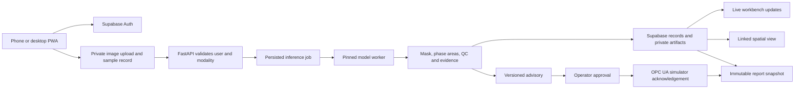

# REEFPRINT / KHANYA — model, live UI, reports and spatial implementation spec

**30 September 2026. Planning specification; no new model trained or PWA deployed by this change.** Extends docs 12–13. Application code belongs in KHANYA's application history. Code inspected at `khanya/main` commit `57a6b665a5370e5d8ba49a16ffaf95451538bc1e`. The existing demo remains the 1 October fallback. The user's judging screenshot is a requirements reference: innovation, feasibility, impact, originality/IP and presentation clarity.

## 1. Product and evidence

REEFPRINT connects **sample → image → predicted phases → reviewed process advisory → acknowledged simulator change → reproducible report**, with geographical context when the sample actually has location data. The strongest presentation is one traceable sample moving through this entire chain.

The current [accuracy report](https://github.com/Sibusiso-K/KHANYA/blob/57a6b665a5370e5d8ba49a16ffaf95451538bc1e/reports/ACCURACY-REPORT.md) reports S2 five-class mIoU 0.5725, three identified sulphides and zero magnetite predictions; a retrain scored 0.4543. These results belong to specific checkpoints. Pixel accuracy 0.8914 must not be labelled '89% mineral identification'. No score on a new upload is known without an expert reference mask. Confidence is not accuracy.

No training method guarantees the next score will improve. The enforceable guarantee is that every candidate has comparable evidence, and a worse candidate does not silently replace the working model.

## 2. Next training runs: fix the experiment before spending GPU time

### Observed code issues and required changes

1. `src/segmentation/patches.py` constructs `random.Random(None if self.train else self.seed + i)`. Each training draw gets system-seeded randomness; simply calling `random.seed` or `torch.manual_seed` elsewhere will not fix this. Replace with deterministic per-sample seeds derived from `(run_seed, epoch, sample_index)` using stable integer mixing, carry epoch into the dataset, and pin DataLoader/worker behaviour. Seed Python, NumPy and Torch too; record backend deterministic settings and any nondeterministic operations. Verify resumed and uninterrupted runs use the same subsequent patch sequence.
2. `train_patches.py` selects `best.pt` from balanced validation patches. Add **whole-section validation** on the existing six validation images with the same tiling, overlap and preprocessing as production. Checkpoints compete on this metric. Preserve patch scores as diagnostics only. Do not call the current `--eval` test path during model selection.
3. Resume currently checks only epoch/patch budgets. Create unique run directories and a config hash covering dataset/split hashes, architecture, initial weights, loss, sampler, seed, optimizer, augmentation and preprocessing. Refuse mismatched resumes. Save RNG, optimizer, scheduler and mixed-precision scaler state where used; save `last`, `best` and immutable run manifests separately.
4. Native 512 px patches and class-balanced centres already exist. Diagnose their actual class pixel content before increasing oversampling: presence of a magnetite centre does not ensure meaningful magnetite area. Audit label lookup, ignore/void policy, absent labels, class counts, boundary alignment, train/validation overlap and duplicate images. Cache keys must include mask/data hashes, not only image IDs.
5. Verify inference builds the model with explicit initialization and then loads the pinned trained checkpoint strictly. Refuse missing/incompatible weights. Training initialization and any offline backbone file must have recorded SHA-256 and attribution.

### Ordered experiment queue

Budgets below are **initial engineering budgets**, subject to measured seconds/step and Kaggle quota; they are not an accuracy prediction. Stop on NaNs, data mismatch, missing weights or invalid masks. Checkpoint on interruption. Do not launch all combinations blindly.

| Run | Change / budget | Evidence and decision |
|---|---|---|
| R0 | Reproduce current checkpoint predictions; deterministic sampler and resume tests; one 128-patch smoke epoch | Match recorded checkpoint outputs and confirm all train classes occur. Validate shapes, label transforms, finite loss and resume lineage before GPU campaign. |
| R1 | Corrected original recipe: 8 × 64 patches, seed 42, same architecture/CE | Establish a reproducible **new recipe baseline**; historical random draws cannot be reconstructed from the old seed. Save full-section validation at each epoch. |
| R2 | More exposure: 20 × 512 patches, seed 42, same architecture/CE | Test undertraining hypothesis with fixed settings. Full-section validation every two epochs plus final epoch; select the best validated checkpoint. Set a hard wall-time budget before launch from R0 throughput. |
| R3 | Same compute as R2, CE + Dice; bounded rare-class sampling only in a separate ablation | Compare at equal processed patches and evaluation cadence. Inspect magnetite recall, precision and spatial false positives; do not improve it by painting everything magnetite. |
| R4 | On the best recipe, physically plausible brightness/white-balance perturbations; reference colour correction as a separate experiment | Establish stable colour behaviour using train/validation references only. Strong arbitrary colour augmentation may erase mineral signal. Evaluate both original validation and a fixed lighting stress suite. |
| R5 | Repeat baseline and leading candidate with seeds 17, 42, 73 | Report mean/range and paired per-image results. Choose a reproducible candidate, not the single luckiest seed. Fit calibration/abstention on a separately reserved calibration partition before claiming coverage. |
| R6 | Optional: one ResUNet baseline, then overlapping-tile blending/TTA or a small ensemble | Proceed only if error analysis justifies it and deployment memory/latency permits. Every architecture gets equal data/evaluation protocol; each inference enhancement must show measured accuracy and latency changes. |

**Promotion policy, registered before R2:** primary objective is pooled foreground macro IoU over all four minerals on full validation sections; also report all-five-class mIoU and per-image summaries. Initial acceptance target: at least +0.02 absolute foreground macro IoU relative to R1, no required sulphide losing more than 0.02 IoU, magnetite having nonzero recall and at least 0.50 precision on validation, and documented runtime/memory within the chosen host budget. These are product decision thresholds, not statistical significance or proven achievable performance. Freeze them in a run manifest before looking at candidate results. With only six validation images, show uncertainty and seed variability; arrange fresh independent data for stronger claims.

After selecting one candidate, freeze config/hash and evaluate on the 12 publisher test images once for the release report. This is a **previously examined regression test**, not a fresh external validation set. Report the result even if worse; an unsuccessful candidate remains an experiment. If original-protocol all-class test mIoU or any required phase materially regresses, retain the old default and explain the trade-off. Do not use the regression result to repeatedly retune. Seek fresh specimen-level splits and expert labels for a subsequent external test.

Store `manifest.json`, train/validation curves, per-class/per-image confusion counts, masks for authorised review, failures, calibration results, cold/warm/end-to-end latency, peak RAM/VRAM, weight hash and model card. Derived area fractions use the same masks and denominator as the UI. Pixel predictions over a single micrograph do not become millions of independent statistical observations; resample at image/specimen level and disclose missing specimen metadata.

## 3. UI: preserve the existing visual language and implement real states

The repository contains `dashboard/templates/khanya.html.jinja`, explicitly adapted from the earlier Stitch design. This is the implementable reference: dark blue `#00131D`, light text `#E3EAEB`, Plus Jakarta Sans, JetBrains Mono, header/navigation, sample metric strip, large image/mineralogy split, computed verdict and evidence panel. Use these existing assets/tokens with their licences. Raw prior generated mockup images were not found in the searched repo/workspace paths; pixel-level comparison remains pending until their files/Figma node URLs are available.

Use React/TypeScript with the existing Tailwind design translated into reusable components. Choose one accessible primitive system (Radix is the proposed choice), semantic controls, visible focus, tabular numerals, text/icons alongside status colours and mobile touch targets. Preserve phase colours from a versioned class map in both overlays and legends. Reserve action colours for status; label phases directly and offer boundaries/hatching so colour is never the only distinction. No automatic animated counters or decorative fake telemetry.

| Screen | Layout and user task | Authoritative backend data |
|---|---|---|
| Samples / phone capture | Sign in; create sample; notes; optionally record GPS with accuracy; import microscope image/assay; sync status | `samples`, `images`, `assays`; device observation time and server receipt time; source and modality |
| Analysis workbench | Left sample queue; central original/prediction/reference viewer; right phase/QC panel; bottom processing timeline | Selected `inference_id`, model manifest, mask, area counts and persisted job status |
| Process response | Source image thumbnail and association evidence; proposed action; current simulator state; approval; acknowledgement timeline | Immutable advisory revision, policy version, approved command and observed simulator state |
| Spatial context | Map/3D/depth strip with layers; select located sample and return to its exact analysis | Survey/location records, CRS, uncertainty, linked sample IDs; no guessed coordinates |
| Reports / model quality | Individual report and separate model validation report; per-phase metrics; failures; download | Persisted report snapshot plus named checkpoint/evaluation artifact |
| Usage / operations | Project storage, processed/failed jobs, API latency, recent errors and service status | Actual request/job/storage measurements with time window; unavailable metrics display 'not measured' |

**Responsive rules:** at desktop widths around 1440 px, use a 240 px sample rail, flexible viewer and 320 px result rail. Below ~1024 px collapse the sample rail; on a ~390 px phone use capture/status/result tabs and expandable details. These are starting design values, not untested guarantees. Full image inspection gets zoom/pan and original-resolution access; phone capture does not imply ordinary camera photos can be fed to the reflected-light model. Unverified modality results in review/hold.

**Reference designs, used for interaction patterns:** ZEISS Intellesis for original/segmentation overlays and class analysis; Leapfrog for layer visibility, clipping and sample selection; QGIS for CRS-aware data inspection. IBM Carbon v11's official Figma Community kit supplies table/filter/notification/accessibility patterns. Keep REEFPRINT's identity and existing layout. These references are not dependencies or partnerships. A Figma layout is a design artifact, never the live data source.

**Figma handoff:** frames at desktop/tablet/phone sizes; reusable SampleRow, PhaseLegend, ImageToolbar, QualityBadge, AdvisoryCard, EventTimeline and ReportHeader; variants for loading, empty, running, complete, hold, stale, failed and disconnected. Annotate each component with API field, unit, action and error behaviour. Use screenshot comparison against the existing template and recovered mockups at fixed sizes during implementation. Community resources must have author/source/licence recorded before asset reuse; no paid kit required. The CLI skill catalogue lookup stalled in this environment; local baseline UI guidance was used. No Figma file was created or modified in this planning step.

## 4. Live data and backend contract

Cloudflare serves the UI; Supabase serves identity, Postgres and private artifacts; FastAPI runs the scientific pipeline. Kaggle trains models. Supabase Realtime can notify the UI when authorised rows change; it is not the job runner. Publish only needed tables, enforce RLS/project membership and explicitly grant intended Data API access. FastAPI checks JWT signature, issuer, audience and expiry plus record ownership; the browser cannot supply authoritative metrics or approval identity. Never send secret/service-role keys to the browser.

State machine: `created → uploaded → queued → running → completed | held | failed`. A completed computation can still have an advisory hold. An API transaction creates a job with idempotency key; a worker claims it with a lease, records progress as measured stages, and commits terminal status only after result artifacts exist. Begin with one bounded worker and one queued job at a time; reject oversized inputs and limit per-user jobs. Persist queue/attempt counts so worker restarts do not silently lose work; avoid relying on an untracked FastAPI background task for durable jobs. Lease expiry/retry must not duplicate results or commands.

Every response/event carries `schema_version`, `project_id`, `sample_id`, `image_id`, `inference_id`, `model_sha256`, `data_sha256`, revision, UTC server timestamp and evidence source (`measured`, `modelled`, `simulated`, `reference`). Use monotonic revisions to ignore out-of-order notifications. Reconnect by fetching the authoritative snapshot, then resubscribe; show last updated time and disconnected badge. Notifications contain IDs/status, not full images. Fallback polling uses backoff and stops on terminal status. No client timer invents an inference percentage; stage labels remain useful when a duration is unknown.

APIs extend doc 12: `POST /v1/inferences`, `GET /v1/inferences/{id}`, `POST /v1/advisories/preview`, `POST /v1/simulator/events`, `GET /v1/reports/{id}`; add `POST /v1/reports` to freeze/export a snapshot and `GET /v1/models/{id}/evaluation` for the accuracy report. Derive TypeScript types from OpenAPI. A shared canonical result object feeds the UI, PDF and exports, so percentages never get recomputed differently in three places. Masks are aligned at native dimensions; downsample categorical labels using nearest neighbour. Authorised tiled images/overlays can use OpenSeadragon; fetch protected assets through short-lived signed access, refresh on expiry, and keep transforms identical.

Initial project roles: viewer, analyst, reviewer/operator, administrator. Cross-project access fails in both API and Storage tests. Only the worker writes metrics; only authorised reviewers approve the exact advisory revision. Upload validation includes decoded dimensions, file type and size, not only filename. Offline phone queue is a later addition with visible pending state and UUID/hash deduplication; initial release must never pretend an offline capture has synced.

## 5. Report output: professional, auditable and honest

Two outputs are required. **A sample analysis report** explains this sample's inference and advice. **A model accuracy report** compares predictions to labelled reference data. An uploaded sample without reference labels cannot have its own measured accuracy score. 'Industry grade' here is a target for traceability/review/reproducibility; it is not accreditation or a mineral-resource certification.

Generate A4 PDF + HTML from the same versioned server-side Jinja template and canonical JSON snapshot; use Playwright/Chromium PDF rendering in the reporting container, with pinned fonts. Export CSV phase statistics and a JSON provenance manifest. Verify totals, units, page breaks, embedded images and absence of clipped text. Store artifact hashes and immutable revisions; re-analysis creates a new revision, not a rewritten old report. Publish a stable authenticated report ID/link rather than an expiring storage URL printed in a PDF.

**Sample report contents:**

1. REEFPRINT / KHANYA, report ID/revision, sample identity, operator/reviewer, timestamps, status and intended use.
2. Acquisition modality, dataset/source, image dimensions, scale if calibrated, preparation notes, sample location/CRS/accuracy if known. Unknown fields explicitly remain unknown.
3. Original image, prediction overlay, stable phase legend, QC flags and optional expert-reference image clearly labelled. Annotations and corrected labels retain author/revision separately from model output.
4. Per-phase pixel counts, total-field area %, ore-area % where valid, explicit background/unknown treatment and denominator. Image-area % does not become mass %, recovery or elemental assay.
5. Apparent 2D association and limitations; confidence/abstention method; model/checkpoint/code/data hashes and preprocessing version.
6. Advisory evidence, rule/threshold version and validation status; approval actor/time; simulator command, before/requested/acknowledged values, unit and status. Held/refused actions are included.
7. Link to the exact model accuracy report, acquisition/domain limits, failures, external validation status and references. Any review signature is an authenticated recorded review, not a decorative stamp.

**Accuracy report contents:** class definitions and counts; split IDs/hashes; data provenance; training settings; per-phase IoU/precision/recall; pooled and per-image confusion; all-class and foreground macro scores; phase-area error; absent-class and zero-denominator policy; full-mask and publisher void-border metrics separately; seed variability; image-level uncertainty; calibration/coverage where validated; failure montages; preprocessing/inference/transfer/report timings on named hardware. Include rejected samples and accepted-only performance separately. Do not transfer scores to a different model SHA. Preserve the existing `reports/ACCURACY-REPORT.md` as a versioned baseline.

## 6. Plant-parameter demonstration

The current `dashboard/control.py` already maps advisory actions to the **simulated** Boolean `regrind_enabled`, through real local OPC UA transport. Reuse this tested transport/domain logic behind FastAPI; move authority to the server. The current module alone does not supply the proposed multi-user approval/audit workflow.

Demo sequence: select a real S2 image → run the named checkpoint → inspect phases/association/QC → compute a versioned advisory → show current simulator state and proposed change → authorised operator approves → server revalidates freshness/model/evidence → send command → show acknowledgement and before/after → export the matching report. Never mark applied on button click or HTTP submission alone.

Keep the existing demo mapping explicit: `Grind finer` proposes `regrind_enabled=1`; `Continue at current setpoint` maps to `0` in the present simulator. The latter is potentially misleading wording when the previous state is 1: the UI must say **'Request regrind bypass (0)'** and display the actual before/after. A future real controller's 'continue' may instead mean hold; metallurgical/site review must settle this before production. Abstention/unsupported reagent advice issues no regrind command. No invented reagent dose or P80 target is derived from an image-area fraction.

Persist command UUID, advisory revision, authenticated approval, expiry and acknowledged status. Atomic server checks prevent stale/replayed/duplicate approvals from changing state. Tests: accepted change with observed 0→1; bypass with 1→0; uncertain sample holds current state; stale command refused; disconnected simulator reports unavailable; double-click is idempotent; other user/project denied; changed model/advisory requires fresh approval. Use a real inference that actually produces each demonstrated state; find it during rehearsal. If none produces an accepted action, present that result honestly and use a separately labelled synthetic integration fixture for control-path testing, never mislabel it as the real model outcome.

This demonstrates operational feedback, not measured energy savings, recovery improvement or an optimal process setting. Processability is currently a **screening proxy** based on apparent 2D association. A calibrated recovery/kinetics model needs matched processing tests and a metallurgist's validation.

## 7. Computer vision and 3D: two linked scales

**Microscope scale:** computer vision assigns phase labels to image pixels. It supplies area fractions, uncertainty and apparent 2D association. Ordinary RGB field photos have different acquisition physics and are not validated inputs. A 2D mask cannot reconstruct real 3D grain volume or true 3D liberation; that would need registered serial sections or micro-CT/tomography and suitable labels.

**Mine/sample scale:** geographical 3D shows where a linked sample came from, its depth, assay and analysis status. Select a sample in the 3D view and open its micrograph/report. This helps trace heterogeneity and choose follow-up sampling; it does not prove a continuous orebody between sparse observations.

Free first implementation: QGIS to inspect/reproject source data and validate CRS; MapLibre for web map context and deck.gl for sample points/paths and supported terrain layers. Start with a local/approved licensed map/terrain source; the renderer being free does not make every tile provider unlimited. A map works without terrain. Borehole tubes require collar coordinates/elevation, depth intervals and a downhole survey; vertical holes can only be drawn when verticality is known or explicitly labelled as an assumption. Missing coordinates get a depth strip/table. Optional later geological interpolation requires source contacts/orientations, validation and uncertainty; it is a separate model, not a decorative solid generated from image percentages.

XRF-like workflow now: import a real assay CSV with sample ID, element, concentration, unit, instrument/method and detection limits, or clearly labelled simulator data for adapter tests. XRF estimates elemental composition; it does not uniquely identify mineral phases. Link an assay and micrograph only if they refer to the same specimen/subsample. Compare them as independent evidence; phase consistency flags are hypotheses pending lab confirmation. Keep mass%, oxide%, ppm and phase area% on separate scales. A phone relays sample records/files; it does not become an XRF sensor. Direct Bluetooth integration waits for a selected device/protocol.

## 8. Implementation tickets and acceptance

| Order | Work and ownership | Done when |
|---|---|---|
| P0 | ML engineer: sampler, manifest/resume, full-section validation and R0 | Two same-seed patch sequences and resumed sequence match; label audit passes; baseline report/weights match; no test images used for selection |
| P1 | ML engineer: R1–R3, then R4/R5 as justified | Comparable manifests, validation curves and failures; explicit promotion/rejection decision; no unsupported accuracy promise |
| U0 | Frontend + backend developer: OpenAPI schema, canonical result fixtures and auth/Storage | Ownership/invalid-image/missing-model cases tested; type-safe UI can show every state |
| U1 | Developer: real inference workbench, live status and responsive shell | One real S2 image yields its own aligned overlay and correct phase totals on desktop; phone can capture/import and see authoritative status |
| U2 | Developer + metallurgist: advisory review, simulator and audit | Approved action produces acknowledged state change; hold/stale/replay/disconnect tests pass |
| U3 | Developer + reviewer: sample PDF and model accuracy report | Same inference IDs/values/hashes in UI/JSON/PDF; download authorised; print visually verified |
| U4 | Developer + geologist: spatial/assay linkage | Source CRS and units verified; marker opens correct analysis; absent location never fabricated |
| U5 | Team: Figma/mock parity, browser tests and demo rehearsal | Screenshot review at 390/768/1440 px; keyboard/contrast/error checks; recorded full workflow and offline fallback |

P0 and U0 are the next implementation tickets. Complete one vertical data path before broad UI polish. No new PWA prerequisite should break the working pitch demo. Luna or Claude Sonnet can implement these bounded tickets; use Sol for experiment design, interpretation of failed/ambiguous results and scientific claims. Training itself runs on Kaggle regardless of the coding assistant model. Reassess after R1 validation, U1 real inference and U2 control tests; do not spend premium-model time merely waiting on GPU epochs.

## 9. Judging and originality

| Criterion | Evidence to show |
|---|---|
| Innovation | One sample's phases, uncertainty, source location and accountable process response; matched ablations if claiming algorithmic improvement. Existing AI microscopy/3D tools mean 'nobody has done this' is unsupported. |
| Feasibility | Live inference, explicit domain limits, measured laptop/server latency and memory, open-source components, working failure path |
| Impact | Actual sample-to-report timings and operator actions; prospective plant trial plan for recovery/reagent/energy outcomes; no hypothetical savings presented as results |
| Originality/IP | Source/dependency/model/dataset/design attribution, licence register, Git commits, run manifests and transparent record of AI assistance. Do not attempt to evade AI-generation checks. |
| Clarity | A short demonstration with original→mask→reason→acknowledged change→report, followed by the honest hold case |

## 10. Official references and reuse notes

- Dataset authors' [Petroscope](https://github.com/xubiker/petroscope): geological segmentation and class-imbalance reference. Cite method inspiration and check licences for any reused code/weights.
- [ZEISS multiphase AI analysis](https://knowledge.zeiss.com/rms/en/zen-core/toolkits-modules/application-and-workflow-toolkits/multiphase-analysis/multiphase-analysis-with-ai): phase-viewing interaction reference; no ZEISS software purchase required.
- [Leapfrog Geo](https://www.seequent.com/products-solutions/leapfrog-geo/): geological interpretation workflow reference; not part of our runtime.
- [QGIS 3D view](https://docs.qgis.org/3.44/en/docs/user_manual/map_views/3d_map_view.html): spatial preparation and review reference.
- [Carbon's official Figma kit guide](https://carbondesignsystem.com/designing/kits/figma/): publicly accessible Community kit instructions; direct Figma preview could not be fetched in this session, so no node inspection or import is claimed.
- [OpenSeadragon](https://openseadragon.github.io/): proposed deep-zoom viewer; [deck.gl TerrainLayer](https://deck.gl/docs/api-reference/geo-layers/terrain-layer): proposed optional terrain renderer.
- [Supabase Postgres Changes](https://supabase.com/docs/guides/realtime/postgres-changes): status subscriptions. Follow project-specific RLS, not an anonymous example policy.

## Implementation prompt

> Continue REEFPRINT/KHANYA using docs/14-model-ui-report-and-spatial-build-spec.md and docs 12–13. Work in KHANYA's application history; inspect current main before changes. Implement P0 and U0 first in bounded PRs, with regression tests and build-log updates. Fix the local random.Random(None) sampler explicitly, preserve deterministic resumed sequences, use unique config-hashed runs, and add full-section validation without touching the publisher test split for selection. Then execute the staged Kaggle queue only within measured quotas. Preserve the known checkpoint until the registered promotion gates pass. Port the existing Stitch-derived dashboard visual language into the responsive PWA, bind every component to canonical server-owned result data, and implement U1–U3 before U4. Include authenticated report exports, real OPC UA simulator acknowledgement and honest failure/hold states. Validate screenshot parity against available template/mock assets; request missing mock/Figma references only when exact matching depends on them. Update the evidence/source register, build log and PR after each meaningful step. Report measured outcomes and unresolved limitations; do not claim higher accuracy, real plant integration or real 3D grain reconstruction without evidence.
