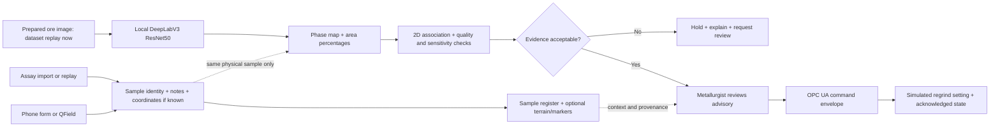

# Build and pitch plan — 29 September 2026

## Decision

Retain the existing microscopy pipeline and build an **evidence-linked mineral-to-process workstation**. Show three sulphide phases, image-quality checks, a processability proxy, and an observable simulated control change. Add a small chemistry/sample-location view only after this complete path works. The user has authorised retraining the missing model. No switch to quantum, hyperspectral acquisition, or a new web framework is required for the deadline.

Use the team's existing name **REEFPRINT (aka KHANYA)**, with the optional descriptor **Mineral intelligence for process decisions**. Keep both names and their existing contribution identities. No rebrand, new domain or trademark search is needed for this hackathon build.

## The clear problem statement

> Mineral-processing teams need to adapt to changing ore, but mineral-phase evidence often arrives after the operational decision it should inform. Mintek's challenge describes laboratory characterisation taking days. Faster image analysis could shorten the interpretation step, but an inaccurate or unstable phase map can also give the plant the wrong advice. We are building a traceable, locally running tool that identifies three mineral phases from prepared-section images, shows when the evidence is unsuitable, and turns accepted results into a reviewable simulated process adjustment.

This is a **latency and decision-reliability problem**. It affects metallurgists choosing treatment, mineralogists interpreting samples, operators implementing settings, and plant managers accountable for yield, reagents and energy. Geologists and samplers supply the provenance; they are not the primary plant-control buyer.

The first customer hypothesis is a concentrator or metallurgical test laboratory that already has prepared reflected-light microscopy images and wants faster interpretation. The first product sits between the sample lab and the metallurgist/operator. It is not yet a conveyor camera or continuous in-stream mineral analyser.

**How long?** The sponsor says characterisation can take days, but no representative site's sample-to-decision distribution has been obtained. SEM/XRD instrument exposure time is not the same as collection, transport, preparation, queueing, analysis and sign-off time. Our software initially saves interpretation/report handoff time; it does not remove polishing or laboratory confirmation. Mintek dates industrial FloatStar work to 1993 and commercialisation to 1994 [E3]: this is a longstanding industrial control need, not a problem invented for the pitch.

**Numbers we can defend:** public S2 has 37 training and 12 test images; the checked-in historical model report has per-class IoUs of 0.5755 chalcopyrite, 0.8695 pyrrhotite and 0.5468 pentlandite, with magnetite 0.0000 [E4–E5]. Those are existing repository results, not a fresh September 29 replication. The new model must earn its own scores. An existing S2 perturbation test changed advice on 8/12 centre crops after synthetic darkening [E6]. This gives a concrete reason to test the reliability of the whole decision chain.

No verified count of affected plants, global losses, customer willingness to pay, KHANYA recovery uplift, or lab turnaround reduction is available. Do not invent a market-size or savings headline. Use the pilot to measure these. Evidence IDs and sources are in [EVIDENCE-REGISTER.md](EVIDENCE-REGISTER.md).

## Proposed solution and its direct effect

| User problem | Product action | What can be demonstrated now | What requires a pilot |
|---|---|---|---|
| Slow manual interpretation | Segment prepared micrographs locally; export phase-area report | Real trained inference and measured runtime after retraining | Total sample-to-decision time saving |
| Mineral proportions alone hide texture | Show phase boundaries and apparent 2D sulphide association | Deterministic calculation and inspection of original image | Correlation with true liberation and processability |
| Wrong or unstable evidence could drive action | Reject bad inputs; flag sensitivity; require review | Quality checks, refusals and perturbation comparisons | Calibrated operating limits on site ore |
| Reports do not reach controls | Convert an accepted advisory into a bounded simulated regrind command | Local OPC UA transport plus changed simulator state and audit log | Site PLC/DCS integration and process benefit |
| Assays, notes and origin are fragmented | Join records by actual sample/batch identity | Assay import, sample card and real geolocated markers where supplied | Matched assay/image/plant records at the site |

The processability output is initially a **screening indicator**: “more detailed regrind review may be warranted,” supported by apparent 2D sulphide association. Do not call it measured recovery, flotation kinetics, grindability, mass-grade, or optimal reagent dosage. The trained model is the segmentation stage; the initial downstream rules are auditable deterministic logic.

## Where the tools fit

Existing code covers much of B/C, an association/advisory calculation and an OPC UA observation transaction. The quality/sensitivity gate, command mapping, simulator parameter transition, unified sample register and map extension are proposed additions. A transaction acknowledging observations currently has `advisory_influenced=False`; that is not a plant-parameter change.

| Tool | Practical job | Decision for this build |
|---|---|---|
| XRF | Measures elemental chemistry with real hardware | Import/replay genuine assays with original method; no imaginary phone XRF |
| PyMca / XMI-MSIM | X-ray spectrum analysis / physical spectrum simulation | Optional later; synthetic spectra cannot validate real ore accuracy |
| Phone | Sample ID, photos, notes, optional GNSS, queued record transfer | Simple capture/import path first; no mobile app rewrite |
| FieldMove Clino | Geological field measurements and notes | Context only; not required for the processing demo |
| QField + QGIS | Field capture, coordinate/CRS QA, GeoPackage and 3D map inspection | Free desktop/mobile route; install only if geography ticket proceeds |
| CesiumJS | Browser terrain and sample markers | Optional local assets; no mandatory ion account or streamed basemap |
| Leapfrog | Geological modelling suite | Not required; no paid dependency in MVP |
| GemPy | Model geological interfaces from contacts/orientations | Later structural model; cannot infer an ore body from assay points alone |
| Streamlit + existing HTML | Current laptop interface | Reuse; keep offline operation |
| asyncua | Local OPC UA exchange | Reuse and extend explicit simulator contract |

## Chemistry and geographical 3D: the useful version

1. Import an assay CSV/JSON, assigning a sample UUID, acquisition time, analyte, unit, method, uncertainty/LOD if supplied, and source file hash. Keep replay unmistakably labelled.
2. Attach notes and coordinates to the same physical sample. When assay and microscopy are genuinely paired, one click can show both. Missing joins remain missing.
3. Update a sample register immediately. A valid coordinate creates/updates its marker on terrain; absent coordinates produce an “Unlocated sample” card, not a guessed pin.
4. Colour by a selected measured analyte with a unit-labelled scale. Keep phase-area percentages, assay mass fractions, oxide concentrations and confidence on different controls. A mineral colour legend is categorical, not a grade heatmap.
5. Link the sample to a process batch only when batch identity and time/transport delay are known. GPS alone cannot identify which ore is entering the flotation circuit.

The local Bushveld dataset gives real chemistry and borehole depth intervals, but no collars, coordinates, CRS or downhole surveys [E7]. It supports an assay table and depth strip. It cannot support a real 3D underground borehole scene. LumenStone S2 and Bushveld assays are unrelated samples: show separate data spaces.

For a geographically real extension, acquire a small USGS geochemical subset with documented coordinates/CRS [E13], retain its actual country/location, and label it a separate provenance demonstration. Use real terrain at its documented resolution. Do not relocate US records to South Africa. If this cannot be validated before the freeze, omit the terrain scene. A fully functioning depth strip is better evidence than an invented ore body.

**Adjacent minerals:** known mineral associations can guide a list of hypotheses or the next test, but one absent phase does not prove another exists. Below detection is not zero. Initially show “not detected / uncertain / not modelled”; defer alternative-phase ranking until a geologist validates priors and matched chemistry exists. XRF does not uniquely resolve mineral phases.

## Innovation, competitors and technology choices

Real-time sensing, segmentation and process control already exist. Blue Cube advertises in-stream spectroscopy with a 15-second measurement time and industrial interfaces [E2]. Molycop OreVia Rock uses vision for rock/particle analysis and control-system integration [E8]. ZEISS Mineralogic addresses automated mineralogy and 3D characterisation [E9]. QGIS, Leapfrog and related tools cover mapping/modelling. We should complement these workflows, not claim to replace every instrument.

Our proposed distinction is the **visible chain from evidence to decision**: every recommendation has a phase map, provenance, freshness, quality/sensitivity status and an acknowledged control outcome. The memorable demonstration is to change only lighting, expose an unreliable answer, and show the system hold the command rather than silently changing the plant setting. This is an integration and evaluation contribution; global novelty is unproven.

| Technology | Recommendation and why |
|---|---|
| Local DeepLabV3–ResNet50 | Retain; compatible data and code exist. Accuracy is class/domain dependent, so evaluate the new weights. No inference API fee. |
| Colour-only classifier | Useful inexpensive baseline to show whether deep learning adds value under the same split. Existing comparator if runnable; do not spend the deadline on a new benchmark suite. |
| Petroscope / ResUNet | Research comparator after deadline; compare matching subsets/protocols and respect toolkit licence. |
| SAM 2 / foundation features | Later annotation assistance or a controlled model comparison. Prompted masks are not mineral identities. |
| Hyperspectral | Future sensor branch if a suitably labelled dataset and acquisition plan exist; not needed for three image phases. |
| LLM, local or paid | Optional wording of already computed reports, never phase ground truth or control authority. No LLM dependency for demo. |
| Quantum / IBM free tier | IBM offers limited free QPU access [E10], but no evidence here of benefit for mineral segmentation or this control task. Do not add to MVP. Later compare a small blending/sampling QUBO with a classical solver under equal budgets; keep only if measured quality/runtime/cost improves. |

## Visual plan: three connected views

**1. Analyse (main stage view):** original micrograph and phase overlay occupy the centre. A compact right panel shows named phase-area percentages, the association proxy, quality status and the advisory with its reason. Raw/model/ground-truth are selectable and labelled. Ground-truth must never masquerade as the model prediction. Show model SHA, sample ID and source in an expandable evidence drawer.

**2. Process response:** one before/after regrind setting, requested versus acknowledged state, timestamp/freshness and a short event timeline. Normal, review and hold states use text/icons as well as colour. A labelled lighting-stress control shows measured mask/advice changes. Do not animate an invented recovery gain.

**3. Sample context (stretch):** terrain with located markers or a borehole depth strip; clicking opens the original assay row, units and source. A phone capture card illustrates the workflow only if that path works. Distinguish recorded assay, image inference and synthetic control visibly throughout.

Keep image colours consistent with the existing class codebook and displayed legend. Use the 3D view as context; the phase image is the main evidence. Cache permitted local assets, provide a 2D fallback and test with Wi-Fi off. No globe fly-through should consume the time needed to explain the actual decision.

## Ten-minute solution pitch, exactly 600 seconds

| Slide | Seconds | What to say/show | Organiser requirement |
|---|---:|---|---|
| 1. Delayed evidence, delayed decisions | 60 | Problem statement, affected roles, sponsor's “days” qualification | Problem |
| 2. Evidence, including our weakness | 60 | Real dataset, class metrics, lighting issue; fresh vs historical labels | Problem / evidence |
| 3. The product in the plant workflow | 75 | Image to reviewed process advisory; sampling/preparation boundary | Solution |
| 4. Live demonstration | 180 | Real inference; labelled simulator change; refusal/stale event | Solution / implementation |
| 5. Why this is different | 60 | Competitor comparison and traceable decision chain | Innovation |
| 6. Value and viable customer | 60 | Measurable pilot KPIs, illustrative economics clearly labelled | Value / impact |
| 7. Pilot, cost and scaling | 60 | 8–12-week gated pilot, budget and deployment model | Feasibility / pathway |
| 8. The ask and next milestone | 45 | Partner lab, labelled specimens, process engineer, pilot support | Pathway |

The optional map belongs within slide 3 or the last 20–30 seconds of the demonstration, only if ready. Put per-class confusion, data sources, rights, evaluation details and assumptions in appendix slides. Produce an actual PowerPoint and local backup recording during implementation; they have not been created by this planning change.

**Pitch close:** “We have a testable route from mineral images to accountable process decisions. Our next step is a site-specific shadow pilot to establish whether faster interpretation and better decision reliability improve real operations.”
