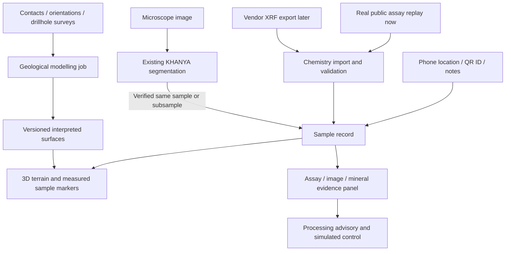

# KHANYA chemistry-to-3D extension

Follow-up on 29 September 2026. The user specifically wants the value of XRF/chemistry arriving on a phone or machine and rapidly updating a geographical 3D view. This document refines the earlier roadmap: a small, traceable assay-to-map feature is a reasonable bounded addition to explore alongside the microscopy core. It is a design, not an implemented or benchmarked feature.

## Recommended product behavior

One incoming sample record automatically links its chemistry, location, collection metadata and any genuinely matching microscope analysis. The 3D view updates the sample marker and element colors. Selecting the marker opens its original assay, notes, photographs, mineral mask and advisory evidence. Geological volumes, if present, are separately versioned interpretations and update only through an explicit modelling job.

The time saving is removal of repeated transcription, spreadsheet joins, unit cleanup and manual map import. It does not shorten XRF acquisition or prove an underground deposit instantly. Measure import-to-visible-update latency and operator interaction count against a manual workflow rather than promising a duration without testing it.

## What an XRF-like input can mean without hardware

### 1. Recommended: a virtual assay feed using real data

A replay adapter reads a public chemistry dataset and submits one measurement at a time through the same contract a future instrument adapter would use. Values and original analytical methods remain unchanged. Mark the event as `replayed`; retain original sample/date and add a distinct replay timestamp. A laboratory ICP assay must not be renamed an XRF measurement.

This tests the real software plumbing, unit validation, synchronization and geographical visualization without pretending to have an analyzer. Offline operation is possible. Start with a CSV import, then expose a simple simulated-instrument sender using the same ingestion service.

### 2. Optional: physical XRF spectrum simulation

[XMI-MSIM](https://github.com/tschoonj/xmimsim) predicts an energy-dispersive XRF spectral response using Monte Carlo simulation. Supply assumed composition, source, detector and geometry; generate synthetic spectra. [PyMca](https://github.com/silx-kit/pymca) provides XRF spectral analysis tools. Together they can support an educational instrument-simulation branch, subject to compatible formats, configuration and validation.

Neither tool was installed or tested here. A simulated spectrum generated from known composition and then inverted is a synthetic test, not independent evidence that real ore can be measured accurately. Detector/source/matrix calibration matters. It is unnecessary overhead for the first assay-to-map demonstration.

### 3. Future: a real instrument adapter

Start with the manufacturer's original export; later use a documented vendor interface where available. Wireless hardware support is not evidence of a public API. The adapter must know instrument make/model, firmware, exported units, detection flags, calibration status and sample/reading identifiers.

A phone camera alone is not an XRF instrument. The existing CNN estimates mineral labels from microscopy; converting those labels to nominal elemental composition would be a model-derived estimate, not an independent chemical measurement. It should never be used as its own validation channel.

## How the parts connect

Microscopy and chemistry are parallel inputs. The microscope model does not process the XRF CSV. The common sample identity connects them; compatible sampling support is needed before attempting numerical fusion.

## Free implementation stack

| Layer | Choice | Responsibility |
|---|---|---|
| Phone field capture | QField, or a small KHANYA mobile web form | QR/sample ID, location, notes, photographs, offline queue |
| Chemistry ingestion | Python CSV parser with explicit vendor/public-data adapters | Validate schema, units, method, sample and QC; preserve original file |
| Local API | Small FastAPI service, if separate phone/viewer clients are needed | Accept records and publish committed updates; proposed dependency, not installed |
| Prototype store | SQLite plus files; GeoPackage for GIS layers/exports | Durable sample records, raw assets and spatial exchange |
| GIS preparation | QGIS | Coordinate checks, terrain crop, sample layers, styling and GeoPackage |
| Geographical browser view | CesiumJS with local assets | Terrain, markers, borehole traces, selectable objects and supported meshes |
| Geological modelling, later | GemPy | Contacts/orientations and geological relationships to interpreted surfaces |
| Existing mineral AI | KHANYA model and measurement modules | Mineral pixels, phase areas, apparent 2D association and existing advisory |

[QField sensor documentation](https://docs.qfield.org/how-to/advanced-how-tos/sensors/) describes external sensor streams and storage in attributes; the [official introduction](https://qfield.org/blog/2023/05/30/qfield-2.8-boosting-field-work-through-external-sensors/) documents TCP, UDP and serial support. This is useful infrastructure, not a ready XRF driver. File import is the first adapter. Do not promise universal Bluetooth pairing.

[CesiumJS offline documentation](https://cesium.com/learn/cesiumjs-intermediate-applications/) supports locally served applications and data. Bundle library assets and a prepared local terrain/imagery area. The open-source renderer is separate from commercial hosted terrain, imagery and tiling services; a paid Cesium ion subscription is not required for a local-data prototype. Default cloud imagery/terrain and geocoding must be removed or replaced to make the actual demo offline.

Avoid a full frontend rewrite. Keep the current Streamlit workflow; add an assay import/sample selector and a locally served geographical view sharing the same sample store. If several browser contexts are embedded, verify how selection IDs propagate rather than assuming the existing HTML iframe automatically communicates with the host.

A phone can reach the laptop through an approved local Wi-Fi network/hotspot; internet is unnecessary once data and assets are local. Offline phone records synchronize later. The local service must be deliberately reachable from the phone, not bound only to loopback. QField cloud synchronization is optional, not a zero-cost dependency to assume.

## Three different 3D outputs

### A. Surface samples on real terrain — first build

Use a verified digital elevation model for terrain and sample coordinates for markers. Select an element to color the markers on a labelled concentration scale. Show uncertainty and location accuracy. These are actual points displayed in 3D; no subsurface model is needed.

Global 30 m terrain is appropriate for regional context, not bench-scale survey claims. [OpenTopography's NASADEM/Copernicus overview](https://www.opentopography.org/news/nasadem-and-copernicus-dem) describes global terrain sources, including a public bucket for Copernicus data. Access conditions differ by provider/API; obtain a legally reusable small area once and keep it locally. Do not assume every hosted API is free.

### B. Assays along boreholes — second build

Required inputs are collar XYZ with CRS/datum, downhole survey (depth/azimuth/dip) and assay intervals. Desurvey to calculate the actual 3D trace, then color intervals. Depth is generally along the hole, not vertical elevation; drawing every hole vertically is only valid if supported or explicitly illustrative. Publish the dip convention and elevation datum.

### C. Interpreted underground domains — later

GemPy uses geological interface and orientation evidence and defined relationships. It can support interpreted geometry when those constraints exist. It does not automatically turn sparse surface chemistry into a reliable orebody or estimate grades everywhere. Element interpolation is a separate validated geostatistical task; a grade model and a structural geological model are different outputs. [GemPy](https://www.gempy.org/), [geological input requirements](https://www.theoj.org/jose-papers/jose.00185/10.21105.jose.00185.pdf)

Show observations as solid markers/intervals and interpreted volumes with distinct styling, source/version and support limits. Keep unsupported regions unknown. Adding a sample can immediately update the markers; model recomputation may be slower and should show pending/completed model versions.

## Data available now, and its exact gap

This session directly inspected:

`data/bushveld_thaba_chromitite/DataSet_Thaba_Classification.csv`

It exists locally (157,067 bytes). Headers include project/borehole IDs, maximum depth, from/to intervals, dates, oxide chemistry, ICP precious-metal concentrations, stratigraphy and a filter flag. **There are no collar easting/northing/latitude/longitude/elevation columns, CRS fields, or downhole azimuth/dip surveys in this CSV.**

Therefore it supports a real assay replay and interval/depth viewer, but cannot on its own support accurate geographical borehole placement. Borehole IDs are grouping identifiers, not map coordinates. Do not invent coordinates or treat them as measured vertical holes. Respect the source's QC filter and original analytical units/methods.

Its SOURCE.md identifies [Bachmann's public dataset](https://data.mendeley.com/datasets/dc8jcnbcvk/1) and CC BY 4.0. SOURCE.md and historical prose differ in some bibliographic details; recheck the publisher citation before the final report. Only the local file/header and recorded provenance were verified this turn, not a fresh dataset download.

For geographical sample markers, the [USGS geochemical data portal](https://www.usgs.gov/tools/geochemical-data-portal-rock-sediment-soil-and-mineral-samples-united-states-and-territories) is a concrete public-data lead. Select a compact rock-sample subset with valid locations, analytical methods, units and meaningful element coverage. Inspect the downloaded schema, coordinate reference and licence before use. This session did not download or validate a specific USGS subset. These are geographically real US data, not South African field validation.

The current LumenStone microscopy and Bushveld assay datasets are **not paired observations of the same samples**. Do not attach one to the other as though they were. Show separate dataset modes, or a prominently labelled integration scenario with an explicit illustrative linkage. Paired data are needed to validate chemistry-image fusion.

## Minimal ingestion contract

- Stable sample UUID, original sample ID, dataset/project, original observation time and replay/import time.
- Original method (XRF, ICP, other), instrument identity when known, original reading ID, element/oxide, value, unit, non-detect qualifier/limit and QC status.
- Optional location with coordinates, CRS, datum and accuracy; missing coordinates stay missing.
- Optional borehole/interval identifiers and separately referenced collar/survey tables.
- Source URL/file hash, original row identifier and measurement/replay/synthetic evidence status.
- Linked image IDs only with verified provenance, plus their modality and sample-support relationship.

Deduplicate by source/reading identity. Preserve original data. Convert units explicitly; do not conflate elemental chromium with Cr2O3 or replace below-detection results with zero. A committed import emits a small update event or is picked up by polling; the viewer updates only the affected sample. A stream disconnect must not erase older observations or make old data look newly measured.

## The demonstration to aim for

1. Open KHANYA's 3D terrain view with an existing set of source-labelled sample markers.
2. On a phone or the laptop, select a sample and import/replay its original assay record.
3. The marker appears or updates, with its collection time and chemistry legend.
4. Switch the element layer; inspect the value, units, method and original source.
5. Select a genuinely paired microscope result if available. Otherwise show the microscopy module separately and state that field-to-microscope linkage is demonstrated by an illustrative scenario.
6. Trace the supported image-derived advisory into the simulated processing view.
7. Optionally reveal separately labelled geological surfaces or borehole intervals whose required spatial inputs actually exist.

This makes the geographic feature relevant to Problem 3: it tracks where ore evidence came from and how it enters a processing decision. A later mine-to-plant implementation must also track stockpile/batch IDs, blending and arrival lag; sampling time is not necessarily plant-feed time.

## Proposed code boundaries and verification

New suggested modules on the KHANYA application branch: `src/chemistry/records.py`, `src/chemistry/importers.py`, `src/samples/store.py`, `src/geospatial/export.py`, `scripts/replay_assays.py`, plus dashboard sample/assay/3D components. These are proposals; no files at those paths were created.

Checks for the first implementation: unit and qualifier round trip, repeat-import deduplication, wrong/missing sample-ID rejection, CRS/location validation, missing coordinates remaining unmapped, stale/replay timestamps, offline reload persistence, and arrival of one record updating exactly the corresponding marker. Measure import-to-render time with the real machine; do not invent performance.

**Next action:** choose between (1) the existing real Bushveld chemistry replay with a depth viewer, and (2) a geographically located public geochemistry subset with real terrain. For the user's requested geographic experience, option 2 is the default recommendation, while retaining the existing microscope demonstration as a separately validated module.
