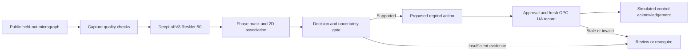

# Start here: KHANYA research handover

Saved on **29 September 2026**, Africa/Johannesburg. This file is intended to preserve the current conversation if credits or context run out. It records an investigation and recommendations, not completed application changes.

## Read these files in this order

1. This handover.
   **Latest user steering:** the user specifically wants chemistry/XRF-like input to rapidly update a geographical 3D view. Read [Chemistry-to-3D extension](KHANYA-CHEMISTRY-TO-3D-EXTENSION-2026-09-29.md) before choosing the next scope. A bounded real-assay replay → location → 3D-marker update is now a concrete proposed addition, rather than dismissing all geographical work as future scope. No application implementation has been requested or performed in this investigation.
2. [Hackathon strategy](KHANYA-HACKATHON-STRATEGY-2026-09-29.md): the current recommendation after the user clarified the brief, budget and lack of instruments.
3. [Tool and pipeline investigation](KHANYA-TOOLS-AND-PIPELINE-2026-09-29.md): FieldMove Clino, QGIS/QField, Leapfrog, XRF, models, evidence fusion, alternative/adjacent minerals and honest 3D visualization. Field integration is the longer-term roadmap.
4. [Continuation prompt](KHANYA-CONTINUATION-PROMPT.md): copy into another chat and attach these files or open this workspace.

These are independent files in the user's project folder. They do not require the previous chat or its visualization directory. No commit or push was made.

## User's objective and constraints

The user supplied `https://github.com/Sibusiso-K/KHANYA` and an image of notes listing FieldMove Clino, QGIS, Leapfrog, geochemistry/XRF and connecting XRF to a phone. The initial request was to investigate how these could improve the build, whether to extend or pivot, where CV/AI models fit, how chemistry and mineral alternatives/adjacency work, and how to visualize the system impressively, including 3D.

The user then clarified:

- This is **Mintek SCi hackathon Problem 3: Computer Vision for Real-Time Mineralogical Characterisation**.
- They **do not have the instruments** and do not know which XRF to choose.
- They want free information, public data, open-source software and simulators, with scientifically defensible results.
- They authorize selecting appropriate minerals and considering a pivot.
- Their aspiration is a highly impressive, original, winning demonstration. Treat this as ambition, not proof that any recommendation is novel or guaranteed to win.
- They explicitly requested this handover plus clear information and a continuation prompt in case credits run out or another chat takes over.

### Brief supplied by the user

Problem: slow SEM/XRD characterization delays feedback to mineral-processing plants. Challenge: a CV/ML algorithm analyzes high-resolution imagery or sensor data, identifies mineral phases in real time, predicts processability from visual/spectral characteristics, and integrates with sorting/flotation controls. Required deliverables:

1. A trained model/software tool identifying **at least three distinct mineral phases** from image datasets.
2. An accuracy report.
3. A demonstration of how model output can adjust plant parameters.

The repository records an **October 1, 2026, 13:00** submission deadline, an offline laptop demo and a ten-minute presentation. These dates were read from the repo, not independently confirmed with event organizers. They make a last-minute sensor/platform rewrite a poor default.

## September 29 build-plan update

Read [README.md](README.md) and its five linked planning documents before continuing. The user supplied the organiser's six pitch themes and ten-minute PowerPoint deadline, requested a build-ready plan and repository push, and explicitly approved retraining because S2 data/weights are absent locally. A separate managed KHANYA application worktree now exists at `C:\Users\USER\.codex\worktrees\khanya-build-plan\REEFPRINT`, with `codex/khanya-build-plan` based on live main `9181668`. Application implementation is for the next Luna stage. Historical findings below remain useful but do not override the new asset audit or priority order.

## Recommended direction — original research proposal

Keep KHANYA's microscopy model. Choose **chalcopyrite, pentlandite and pyrrhotite** as the three demonstrated phases from the current S2 task. Build the story around mineral evidence → visible 2D association → a justified simulated control response, with explicit refusal when evidence is unsuitable.

The valuable shift is toward **decision reliability**, rather than field exploration. Use an image replay to replace unavailable acquisition hardware, real inference to produce masks, and a local protocol connection to a simulated control state. Present replay as replay, and simulation as simulation.

Do not make XRF, phone pairing, QGIS, FieldMove, Leapfrog or a 3D underground ore model prerequisites for this submission. They are meaningful later additions to a sample-centred field-to-lab platform, but are weak uses of the immediate deadline.

Proposed main demo:



The intended memorable experiment is: same ore, different imaging conditions; show how image errors can change advice; then show a validated quality gate withholding an unreliable adjustment. The existing repository exposes the first phenomenon. The proposed protective gate has **not** been implemented or proven in this session.

An optional stretch feature is a **decision sensitivity overlay**: which ambiguous image regions could actually change the proposed action? Evaluate against an ordinary uncertainty overlay and label counterfactual results as scenarios, not calibrated probabilities. Finish the required pipeline first.

## Repository state and access

- Working directory: `C:\Users\USER\Desktop\REEFPRINT`.
- Additional writable copy: `C:\Users\USER\Desktop\REEFPRINT - Copy`.
- Current checkout branch was named `main`, but it contains the REEFPRINT physics/research history, not the KHANYA application history. **Branch name alone is misleading.**
- Local HEAD observed: `ae5f749` (September 15, 2026).
- Git remote `khanya`: `https://github.com/Sibusiso-K/KHANYA.git`.
- Cached `khanya/main`: `ca2e02f807d939c13ecbfbdd618ff948bd06baac`.
- Live GitHub `main`, verified via authenticated CLI: **`9181668cffd9350211a9a8a2cf0b44c80f8deaee`**, committed September 15, 2026 at 20:11:12 UTC.
- Compared cached head to live head. Core inspected model/dashboard code was not among intervening changes; newer corrections and the illumination report were examined.
- No fetch, branch switch, merge, checkout, trained-weight download, package install, commit or push was performed.
- Initial workspace `git status --short` was empty. This session adds the `handover/` files only to that workspace. Check again before future work because user changes may follow.

The GitHub connector returned 404 and unauthenticated web access failed. The local GitHub CLI initially could not read its config under the sandbox; a read-only escalation succeeded. Do not infer the repository is deleted from the connector's 404.

Successful read pattern:

```powershell
gh api repos/Sibusiso-K/KHANYA/commits/main --jq '{sha: .sha, date: .commit.committer.date, message: .commit.message}'
gh api repos/Sibusiso-K/KHANYA/contents/reports/ILLUMINATION-STABILITY-2026-09-15.md?ref=9181668cffd9350211a9a8a2cf0b44c80f8deaee -H 'Accept: application/vnd.github.raw+json'
git show khanya/main:src/segmentation/model.py
```

Future work should recheck the live head. Read local `WORKBOARD.md`, relevant repository instructions and current files before edits; do not obey stale next-action instructions in old documents over the user's current request. Two project histories are intentionally separate; do not merge them to simplify access. If application work is requested, use the actual KHANYA checkout or an appropriately based managed worktree rather than modifying the physics checkout blindly.

## What already exists, supported by inspected source

- `src/segmentation/model.py` on KHANYA main: **Torchvision DeepLabV3 with ResNet-50**, not DeepLabV3+. Training initialization is explicitly COCO_WITH_VOC_LABELS_V1; evaluation avoids fetching generic backbone weights.
- `src/segmentation/train_patches.py`: patch training, tiled inference and single-field prediction.
- Default actual trained-weight path expected by dashboard: `checkpoints/lumenstone_s2_patches/best.pt`. **File presence and a real inference run were not verified.** The constructor alone is not a trained mineral model.
- `dashboard/app.py`: existing offline Streamlit/local-HTML interface, real image inference path, live single-field mode and full-section mode.
- `src/modal.py`: phase area calculations, morphology/topology processing, apparent 2D sulphide association.
- `src/advisor.py`: deterministic rules over mineral roles, with multiple unsourced placeholder thresholds and a fixed empirical uncertainty margin that does not guarantee coverage on future uploads.
- `dashboard/opcua.py`: local OPC UA server/client exchange and a simulated consumer; publishes observation percentages such as association and confidence; handles stale/refused results.
- REEFPRINT includes explicit acquisition/rotation geometry checks, registration tools, Stokes/extinction calculations, provenance/uncertainty components and integration code. ADR-0004 makes polarimetry a research thread rather than the submission's main evidence.

**Most actionable integration finding:** publishing a percentage called association or confidence is not yet an explicit plant-control mapping. Add a simulated process state, such as a regrind request/enable, with a documented policy, approval/interlocks, acknowledgement and expiry. Do not manufacture an optimal reagent dosage from a micrograph.

## Scientific evidence and traps to preserve

1. **Magnetite failure:** the reviewed S2 checkpoint's repository evidence reports no magnetite predictions in its evaluated test data. Do not claim four detected mineral phases plus background, and do not interpret non-prediction as absence. Three sulphides are the demonstrated target story; the failed class remains in the report.
2. **Domain:** S2 is Norilsk reflected-light polished-section imagery. It is not validation on UG2, Merensky, Platreef or outdoor phone RGB.
3. **Lighting:** the live illumination report found advice changed in 5/10 V1 paired images with S1 and 8/12 S2 crops under a synthetic exposure change. Small centre-crop studies; not full-section results or deployment error rates. V1 lacks masks, so consistency is not accuracy. Never repeat the retracted S2-on-V1 8/10 figure.
4. **Latest benchmark correction:** S1's 20-image v2 test metric must not be compared directly to the published 16-image v1 result. Live main corrected the protocol-aligned result to 0.6881 plain / 0.7224 void-border versus published 0.8373 / 0.8506; the void-border gap is −0.1282. The old 60.8% tennantite gap attribution is retracted for that comparison; updated attribution is 47.1% tennantite and 28.6% galena. Avoid unnecessary headline metric reuse without reading the exact artifact.
5. **Decision-gap correction:** newer main reports topology refinement converts some silent wrong decisions to explicit hedges; do not repeat the earlier claim that it necessarily reduces total disagreement/flip rate. A refusal is neither automatic correctness nor a recovery improvement.
6. **Sampling independence:** no patch-level random splitting across the same image/specimen. Group real specimen IDs when known; do not claim stronger independence than the dataset metadata establishes.
7. **Quantity meaning:** image area%, mass%, volume%, confidence and elemental concentrations are different. A 2D association proxy is not verified 3D liberation, grade, throughput or plant recovery.
8. **Rotation data:** public S3 rotation images required registration and geometry verification. Old per-pixel null/geometry claims were withdrawn. Do not claim real Stokes mineral separation from that archive based on the phantom result.
9. **Thresholds:** a cited general process principle does not validate a site-specific numerical decision rule. Use the same frozen rule on expert and predicted masks to evaluate perception-induced decision errors, and call it a reference policy, not process ground truth.
10. **Calibration:** fit quality/uncertainty thresholds on separate calibration/validation data. The S2 test set is already heavily inspected; a new threshold optimized on those examples needs a fresh evaluation or a clearly labelled exploratory result.
11. **XRF:** chemistry constrains candidate minerals; it does not uniquely identify mineral phases. Non-detect and unmeasured are not zero. A bulk XRF reading cannot be assigned to every pixel as ground truth.
12. **3D:** photogrammetry recovers visible surface geometry; geological models interpolate constrained interpretations; internal mineral volumes require appropriate volumetric evidence. Extruded masks or generated geology are illustrative only.

All numerical repository findings above are attributed readings, not independently rerun by this investigation.

## Free/public resource findings

- **LumenStone**: research-use images and masks; S2 for the current task; S1/V1 separately for their matching model and repeatability tests. Research use with citation is explicit; unrestricted commercial reuse/redistribution is not established. [Official source](https://imaging.cs.msu.ru/en/research/geology/lumenstone)
- **Petroscope**: authors' toolkit and benchmark reference; GPL-3.0 per repository. Do not silently incorporate it into a project with incompatible distribution requirements. Its calibration and sampling methods are useful research references. [Repository](https://github.com/xubiker/petroscope)
- **Torchvision**: current model implementation and initialization. [DeepLabV3 documentation](https://docs.pytorch.org/vision/stable/models/generated/torchvision.models.segmentation.deeplabv3_resnet50.html)
- **FreeOpcUa / asyncua**: open-source client/server already aligned with the integration code. [Repository](https://github.com/FreeOpcUa/opcua-asyncio)
- **MODSIM**: publisher advertises an open-source release and mineral-processing flowsheet models. Direct page retrieval timed out, while indexed official content was available. Repository, licence, executability and integration were not verified. Treat as a later lead, not a tested dependency. [Publisher](https://www.mineraltech.com/MODSIM/)
- **SAM 2.1**: optional expert annotation assistance, not a ready mineral classifier. [Repository/checkpoints](https://github.com/facebookresearch/sam2)
- **Minerals in the Wild**, August 2026: abstract says paired hyperspectral/XRF for 1,132 European specimens. Only abstract reviewed; not a UG2 microscopic label set or proof phone RGB can identify minerals. Dataset access/licence not checked. [Paper](https://arxiv.org/abs/2608.30537)
- Prior project docs mention **USGS mafic-ultramafic thin sections**, DOI `10.5066/P1SUMMMI`, as unlabelled cross-domain imagery. This lead was read in repository docs, not independently verified this session. It cannot provide pixel-accuracy results without labels.

### Prior art that prevents unsupported novelty claims

- [Uncertainty for mineral-segmentation annotation, 2025](https://isprs-archives.copernicus.org/articles/XLVIII-2-W9-2025/123/2025/).
- [Experimental economic MPC for flotation, 2024](https://arxiv.org/abs/2410.19661): calibrated dynamic model and laboratory process, not transferable performance evidence for our simulator.
- [Existing AI flotation dashboard/simulator repository](https://github.com/BurgosSaavedra/MAGS-in-Flotation-Digital-Twin): demonstrates that the broad AI-plus-digital-twin concept already exists; not adopted or validated here.

### Field / geological roadmap sources

- [FieldMove Clino / Petex](https://www.petex.com/products/move-suite/digital-field-mapping/): structural measurements, georeferenced notes/photos, CSV/MOVE/KMZ exports.
- [QGIS 3D](https://docs.qgis.org/3.40/en/docs/user_manual/map_views/3d_map_view.html) and [QField](https://github.com/opengisch/QField): GIS preparation and offline phone collection.
- [Leapfrog Geo](https://www.seequent.com/products-solutions/leapfrog-geo/) and [supported formats](https://www.seequent.com/help-support/leapfrog-geo/): specialist geological modelling, licence-dependent.
- [GemPy](https://www.gempy.org/): open-source geological modelling candidate, not a shortcut around missing geological evidence.
- [Vanta XRF](https://ims.evidentscientific.com/en/products/xrf-analyzers/vanta): optional wireless features do not prove an open universal phone API.
- [XRD mineralogy versus chemistry](https://www.bruker.com/en/applications/academia-materials-science/mineralogy/x-ray-bulk-mineralogy.html).
- [EPA 6200](https://www.epa.gov/sites/default/files/2015-12/documents/6200.pdf): QA background; old soil/sediment method, not a current ore-instrument specification.
- [COLMAP](https://colmap.github.io/tutorial): surface reconstruction.
- [CesiumJS](https://cesium.com/platform/cesiumjs): 3D geospatial rendering, not mineral inference.

## Work completed in this conversation

- Read the user's image as context, not as an instruction document.
- Inspected local project documentation and cached KHANYA application files.
- Verified live GitHub main and examined relevant newer changes.
- Researched the named tools, public data, model roles, simulator options and prior art using primary sources.
- Wrote a detailed tool/pipeline report and a revised hardware-free hackathon strategy.
- Saved this handover and a continuation prompt in the workspace.
- Follow-up: researched the assay-to-3D extension, QField sensor integration, local/offline Cesium, XMI-MSIM/PyMca, and geolocated public-data options. Directly verified the local Bushveld CSV exists and contains chemistry/depth intervals but no geographic collar coordinates or hole surveys. Saved the extension design above. Still no inference, simulation or application implementation.

## Not done — do not imply completion

- No application code changes, model training, benchmark rerun or new accuracy claim.
- No checkpoint availability verification, real image inference, hardware connection or plant connection.
- No simulator built, validated recovery prediction, quality gate, decision-sensitivity map or new controller mapping implemented.
- No interactive dashboard or 3D artifact was created. Visual design is specified in the strategy and the diagram above.
- No new dependency installed, data licence resolved, cloud compute launched or PR created.
- No full novelty/patent search and no guarantee of competition outcome.

## Exact next useful work

If the next chat is continuing investigation, read the strategy and answer the user from this evidence; avoid restarting broad research.

If the user asks to implement the recommendation:

1. Locate the actual current KHANYA application checkout or prepare an isolated checkout at the verified latest `main`. Inspect current changes and existing instructions. Preserve the REEFPRINT history.
2. Verify that the actual checkpoint and suitable public images exist. Reproduce one real inference and the exact current evaluation protocol. Record source/checkpoint/data hashes and specimen IDs.
3. Inspect current dashboard and OPC UA consumer. Implement the smallest explicit advisory-to-simulated-control mapping with acceptance, uncertainty, staleness and acknowledgement tests. Keep process settings labelled illustrative unless calibrated.
4. Define and evaluate a narrow image-quality/refusal improvement without training on test examples. Report accepted-case errors and refusal coverage together.
5. Present micrograph → mask → association evidence → simulated control state as linked views. Run the complete demo offline and record backup. Consider the optional decision-sensitivity overlay only afterward.

Immediate blockers needing discovery, not guessed answers: current application checkout, checkpoint and image availability, actual machine performance, fresh validation/calibration data, and how much implementation time remains. There is no hardware purchase prerequisite.
