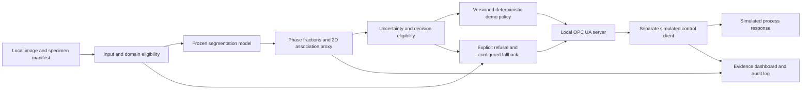

# KHANYA / REEFPRINT — adversarial technical and submission review

**Date:** 12 September 2026\
**Reviewer:** Codex (AI-assisted review requested by the team)\
**Reviewed main:** `abc87a73b1197ab16e45ce42af839d411b5667a4`\
**Reviewed REEFPRINT:** `0b1166f453048d23158e79de6fd13590a63e2d11`

This document preserves the full review delivered in the project conversation.
It is feedback and a proposed plan, not a record of implemented fixes, independent
model validation, legal clearance, or team acceptance of every recommendation.
Repository-reported results, analytical findings, assumptions, and missing evidence
are distinguished in the review. The schedule reflects the 12 September review date.
No runtime or scientific implementation is changed by publishing this document.

---

**Verdict: the current positioning loses against a team that delivers the literal brief cleanly.** You have substantial engineering, but you are combining a binary segmentation headline, an unvalidated polarimetric interpretation, analogue ore data, and hypothetical plant actions into a stronger claim than the evidence supports. Keep the existing segmentation pipeline; demonstrate chalcopyrite, pentlandite and pyrrhotite; connect its output through a real local OPC UA interface to an explicitly simulated circuit; and make one modest processability proxy auditable. Move polarimetry off the critical path. Your immediate blockers are data rights, the evaluation split, and the missing validated runtime artifacts—not another architecture. This redesign can produce a credible entry in 19 days, but neither UG2 performance nor metallurgical benefit can honestly be promised without data you currently lack.

| Brief requirement | What exists today | Gap | What closes it | Estimated effort* | Owner |
|---|---|---|---|---:|---|
| Implementable minerals-sector solution | Segmentation, measurement code, dashboard, REEFPRINT components | No verified packaged end-to-end run in this checkout | Restore exact artifacts; pin both branches; rehearse installed release offline | 3–4 PT-days | Sibusiso |
| Analyse high-resolution imagery or sensor data | Native-resolution, tiled S2 inference | Laptop runtime and memory unmeasured | Benchmark the shipped pipeline, including decoding and postprocessing | 1–2 PT-days | Sibusiso |
| Identify at least three distinct mineral phases | S2 reports nonzero IoU for three sulphides | Headline metric is from a different, binary task; locality separation unproven | Correct report; verify specimen/locality manifest; reproduce phase results | 3–4 PT-days | Sibusiso |
| Trained model or software tool | Training and inference implementation | Validated checkpoint and raw demonstration images absent here | Recover checkpoint, configuration, hashes, original images and provenance | 1 PT-day, externally dependent | Sibusiso |
| Accuracy report | Aggregate JSON reports and documented failures | Honest grouping, CIs, trivial baselines and independent calibration incomplete | Produce the report specified below | 3 PT-days | Sibusiso |
| Predict processability from visual/spectral characteristics | Apparent liberation/association calculation; three proposed heads absent | No paired flotation outcomes; proposed UG2 heads lack required inputs | Ship one clearly labelled structural proxy and a conditional process model | 3–4 PT-days | Lethabo |
| Integrate with sorting/flotation controls | Dependency-free `AdvisoryRecord` | No server, consumer, acknowledgement or expiry contract | Real local OPC UA server and separate simulated control client | 3–4 PT-days | Lethabo |
| Immediate operational feedback | Dashboard recommendations | No measured delay; unsupported operational thresholds | Timestamped output, measured latency, explicit simulator recipe and refusal path | Included above | Both |
| Demonstrate plant-parameter adjustment | Text recommendations | No demonstrated parameter consumption | Show a real protocol transaction changing a simulated parameter, then refusing stale/degraded input | 1–2 PT-days | Both |
| Respect IP through MOTT arrangements | Git history and partial SBOM | Data permission, weights, contributor/institution rights unresolved | Rights register, permission requests and MOTT clarification | 2–3 PT-days; response time unknown | Both |
| Innovation, skills and collaboration | Complementary technical contributions | Two names and disconnected evidence obscure the product | One product narrative and contributor/architecture slide | 1 PT-day | Both |
| Submit by 1 October, 13:00; present in ten minutes | Plans and partial backup media | Full submission rehearsal missing | Freeze on 25 September; dry-run submission on 30 September | 3 PT-days | Both |
| **Your additional requirement: locality-disjoint validation** | REEFPRINT split utilities | KHANYA loader uses dataset folders and image IDs | Obtain locality mapping and rebuild splits before training | **Cannot guarantee closure without metadata** | Sibusiso |
| **Your additional requirement: texture falsification** | Statistical implementation and geochemical association result | No paired texture, pyroxene and assay observations | Publish “not testable with available data,” with missing-data specification | 0.5 PT-day | Lethabo |
| **Your additional requirement: permissive shipment** | Mostly suitable code candidates | LumenStone permission and actual dependency closure unresolved | Explicit rights clearance or replacement dataset | **Cannot guarantee closure in 19 days** | Both |

\*All effort figures below are **planning estimates**, not measurements. A PT-day means one person’s part-time working day. For scheduling only, I assume approximately three focused hours per person per day: 38 PT-days across two people. Estimates overlap where the same work closes several requirements; do not add this matrix mechanically.

**What I inspected—and what the latest commits actually establish**

The repository cloned successfully.

- Default branch: `main`, commit **`abc87a73`**, 5 September 2026: “Harden offline Stitch dashboard and decision pipeline; document audit.”
- REEFPRINT branch: **`0b1166f4`**, 12 September 2026: “Correct the audit prompt against the merged branch state.”

The latest REEFPRINT commit corrects documentation; it does not implement the missing heads or OPC UA server. The latest main commit contains useful hardening: preventing implicit pretrained-weight downloads, validating measurements, correcting conformal wording, handling missing checkpoints and invalid uploads, and adding regression tests.

My review is based on source inspection, checked-in reports and external primary sources. **I did not reproduce trained-model accuracy or the reported test counts.** The attempted local test run stopped because the available Python runtime lacks `pytest`; the validated checkpoint and raw images are also absent from this clone. The repository’s prior audit reports 87 main tests and 314 REEFPRINT tests passing, with seven backlog tests deselected.

**The findings that should change your entry**

**1. Your quoted accuracy is not the required task.**

Your prompt says:

> “mean IoU 0.872 / pixel accuracy 93.75%”

The repository’s `reports/segmentation_test_metrics.json` contains **two** class IoUs. `src/segmentation/lumenstone.py` explicitly identifies this as the older FeM binary ore/resin pipeline.

The current checked-in native-resolution reports say:

| Evaluation | Reported test images | Mean IoU, including background | Pixel accuracy |
|---|---:|---:|---:|
| S2 phase segmentation | 12 | 0.5725 | 89.14% |
| S1 phase segmentation | 20 | 0.7116 | 85.93% |
| Older binary segmentation | Not recorded in that JSON | 0.8722 | 93.75% |

These are **repository-reported results**, not independently reproduced measurements.

S2 per-class IoUs are:

| Class | IoU |
|---|---:|
| Background | 0.8709 |
| Chalcopyrite | 0.5755 |
| Magnetite | **0.0000** |
| Pyrrhotite | 0.8695 |
| Pentlandite | 0.5468 |

The magnetite confusion report concerns the **resize baseline**; do not attach its exact confusion percentages to the patch checkpoint without reproducing that confusion matrix.

**Action: correct every headline and attach each number to a task, checkpoint, dataset version and split. Cost: 0.5 PT-day within reporting.**

**2. KHANYA does not demonstrate your locality-split rule.**

`split_ids()` reads the archive’s train/test directories and randomly selects validation image IDs from training. It does not consume a locality manifest.

The comment:

> “test/ is never touched during development”

also no longer describes the whole project: test-section outcomes have informed topology, uncertainty and recommendation work.

This does not automatically prove training leakage. It means:

- Locality separation is **unverified**.
- The repeatedly inspected test set is now a retrospective development benchmark.
- A split helper existing on another branch does not establish that the trained checkpoint used it.

Do not relabel specimen separation as locality separation. S1 versus S2 is also not a clean substitute: their phase vocabularies and geological settings differ.

**Action: reconstruct the split and development history before any further training. Cost: 1 PT-day initially; closure depends on metadata.**

**3. Your “plant recommendation accuracy” is agreement with your own rule.**

`src/decision_gap.py` derives the reference action from an annotated mask using the same measurement/policy machinery. That tests whether segmentation changes the policy’s answer. It does **not** establish that either answer is metallurgically correct.

The refined patch report records six recommendation differences across twelve sections, with zero classified as unsafe under its internal taxonomy. Report that as **retrospective rule agreement**, not validated plant safety.

There is another definition problem: `src/modal.py` uses a payload-area threshold of 0.50 to call a particle liberated, and `src/advisor.py` uses 0.50 again as an aggregate action threshold. Surface exposure, cross-sectional composition, fraction of payload in qualifying particles and flotation recovery are different quantities. One approximate literature threshold cannot validate all four.

If these are intact polished rock sections rather than prepared particulate mounts, connected regions separated by resin may not represent the feed particles whose liberation governs flotation at all.

**Action: rename the existing output “apparent 2D sulphide association index” until specimen preparation and particle identity are verified. Cost: 0.5–1 PT-day within the proxy work.**

**4. Pyrrhotite is not a universal PGE reject phase.**

Your prompt characterises it as:

> “anisotropic, depressed, low PGE”

KHANYA maps it to `reject`. That may be appropriate for a specified nickel separation objective, but it is not a transferable Bushveld PGE policy. Published work explicitly distinguishes nickel operations that reject pyrrhotite from PGE operations that target its recovery. Merensky work associates PGEs with chalcopyrite, pentlandite **and pyrrhotite**. [Becker’s mineralogical/flotation study](https://repository.up.ac.za/items/84daed9e-f097-4868-ba99-2239b13f96a0), [Merensky reagent-suite study](https://www.sciencedirect.com/science/article/abs/pii/S0892687506001099).

**Action: remove default pyrrhotite-rejection advice from the Bushveld presentation. Require an explicit, versioned ore-and-objective recipe. Cost: 0.5 PT-day plus domain review.**

**5. There is a deeper polarimetry problem than registration.**

The Stokes module says:

> “an isotropic phase shows no modulation as the analyser turns”

For fixed linearly polarised illumination and an ideal isotropic reflector at normal incidence, that is false.

A simple analytical counterexample is enough. Let the reflected field remain linearly polarised:

\[
(S_0,S_1,S_2)=(I_0,I_0,0).
\]

Your analyser equation then gives:

\[
I(\theta)=\tfrac12 I_0(1+\cos2\theta)=I_0\cos^2\theta.
\]

The isotropic reflector therefore has full analyser modulation and degree of linear polarisation equal to one. These are ideal mathematical values, not measured mineral results.

An isotropic specimen stays dark when the **specimen rotates between fixed crossed polars**. Rotating the analyser moves it away from the crossed position. Those experiments are not interchangeable.

Under a suitably specified unpolarised illumination arrangement, polarisation generated by differential reflectance can carry material information. But that requires a different, explicit forward model and instrument calibration. Output Stokes parameters describe the light; they are not automatically intrinsic mineral anisotropy.

Consequences:

- The inversion can be mathematically correct while the mineral interpretation is wrong.
- The synthetic separation validates recovery of the supplied phantom parameters.
- It does not validate mapping crystal symmetry to those parameters.
- Registered specimen-rotation images still do not become a rotating-analyser acquisition.

**Action: add the isotropic-reflector counterexample and rewrite the acquisition/interpretation specification before further mineral claims. Cost: 0.5–1 PT-day.**

**6. The anti-hyperspectral premise is too categorical.**

Your prompt says chromite has no absorption features and calls chromitite spectroscopy a brightness meter.

Chromite has documented electronic absorption features, including visible and near-infrared behaviour. Hyperspectral mineral identification is not restricted to molecular vibrational absorption. That does not establish a successful UG2 hyperspectral system; it invalidates the blanket dismissal. [Chromite spectroscopy study](https://pubmed.ncbi.nlm.nih.gov/15863040/), [reflectance-composition study of spinels and chromites](https://journals.uair.arizona.edu/index.php/maps/article/download/14938/14909).

Replace the claim with:

> “We investigate whether reflected-light imagery and polarisation provide useful complementary information for opaque sulphide assemblages under controlled preparation and illumination.”

Your precise UG2 chromite volume range also needs an ore-specific source and denominator. Do not interchange volume fraction, mass fraction and image area fraction.

**Action: revise the physics slide and abstract extension. Cost: 0.5 PT-day.**

**7. The safeguards are not yet one shipped contract.**

KHANYA’s live path is image → CNN → modal calculation → `advise()`. It does not call the REEFPRINT quality gate or abstention type.

Further source findings:

- Mean softmax confidence changes a confidence label; it does not itself prevent an intervention.
- The default 0.335 uncertainty margin is an average of retrospective fold widths, not a deployment conformal quantile.
- `AdvisoryRecord` lacks units, timestamps, expiry, quality state and finite-value validation.
- Its frozen dataclass still contains a mutable dictionary.
- `verdict_state()` falls through to a favourable state for an unrecognised action string.

None requires a new research programme. They require a shared release boundary and end-to-end tests.

**Action: unify the decision schema, remove string-based safety classification and test the real dashboard-to-consumer path. Cost: 2 PT-days within integration.**

**8. Your Bushveld association result is not the promised falsification.**

The checked-in report uses 1,112 observations and 305 boreholes, testing Cr#/Mg# beyond Cr₂O₃. The code computes fitted R² and cluster-robust inference; this is not an out-of-locality predictive evaluation.

It does not include texture or pyroxene fraction. Boreholes within an orebody are also not automatically independent geological localities for a generalisation claim.

Use:

> “A separate geochemical association analysis found additional fitted association after controlling for Cr₂O₃.”

Do not use it as evidence that texture predicts processability, or that the original H₀ was rejected.

**Action: publish separate statuses for the original test and exploratory chemistry analysis. Cost: 0.5 PT-day.**

**The redesign**

Use one public product name:

> **KHANYA — mineral maps with an auditable path to process advice.**

Describe REEFPRINT as its measurement research component.

The release data flow should be:

The release must distinguish four things everywhere:

- **Measured/computed:** model output and quantities calculated from that output.
- **Reference:** quantities calculated from expert annotations.
- **Assumed:** thresholds and coefficients in the demonstration policy.
- **Simulated:** process response and its consequences.

Calling something “computed” does not make it physically validated. A computed image proxy remains a proxy.

**Decision: model**

**Recommendation:** retain the current DeepLabV3–ResNet50 pipeline and, only if needed, perform one bounded fine-tuning experiment.

The implementation is torchvision **DeepLabV3 with a ResNet50 backbone**, not DeepLabV3+. Its starting enum is `DeepLabV3_ResNet50_Weights.DEFAULT`; the upstream implementation currently maps that to `COCO_WITH_VOC_LABELS_V1`. Pin the explicit enum and checkpoint hash rather than `DEFAULT`. [Torchvision implementation](https://raw.githubusercontent.com/pytorch/vision/main/torchvision/models/segmentation/deeplabv3.py).

Licensing needs precision:

| Candidate | Exact weights | Licence position | Estimated work |
|---|---|---|---:|
| **Keep/fine-tune current DeepLabV3–ResNet50** | Existing KHANYA `best.pt`; ancestor `COCO_WITH_VOC_LABELS_V1` | Torchvision code is BSD-3-Clause; the complete checkpoint/data permission chain is **not cleared by that fact** | 2–3 PT-days |
| Alternative 1: small U-Net trained from scratch | None | Own implementation can be permissively licensed; training-data rights remain necessary | 3–5 PT-days |
| Alternative 2: frozen DINOv2 ViT-S/14 with a supervised segmentation head | `facebook/dinov2-small` | Published Apache-2.0 checkpoint; record exact revision and notices | 4–6 PT-days |

The [DINOv2 checkpoint](https://huggingface.co/facebook/dinov2-small/tree/ed25f3a31f01632728cabb09d1542f84ab7b0056) offers clearer published weight licensing, but swapping to it does not solve LumenStone’s data terms.

SAM 2.1 Tiny, `sam2.1_hiera_tiny.pt`, is a legitimate Apache-2.0 candidate for annotation assistance. It produces prompted masks, not reliable mineral identities without a supervised semantic stage. Introducing that workflow now would cost approximately 2–4 PT-days before proving an advantage. Keep it out of the shipped path. [SAM 2 licensing and checkpoints](https://github.com/facebookresearch/sam2).

**What changes my mind:** measured laptop failure, unrecoverable current weights, or unresolved pretrained-weight rights combined with an already successful replacement pilot. Better benchmark reputation alone does not.

Your GPU budget supports a **bounded experiment programme**, not a guaranteed number of full training runs:

1. Measure one representative epoch, validation pass, peak GPU memory and checkpoint size.
2. Calculate complete-run cost from those measurements.
3. Allocate only jobs that fit the remaining actual quota, including final evaluation.
4. Stop training when integration/reporting becomes the bottleneck.

With the supplied 60 GPU-hours/week, pretrained fine-tuning is plausible; full foundation-model pretraining, broad architecture search and repeated full-resolution ensembles are not credible priorities. Actual epochs achievable: **UNKNOWN — needs measurement**.

**Decision: housing and inference**

**Recommendation:** one native Windows release folder, local Python runtime, local weights, local browser UI, and a local Node OPC UA sidecar. No Docker or WSL requirement on stage.

- Start with the known PyTorch FP32 path.
- Export an output-only wrapper to ONNX FP32.
- Compare masks, per-class metrics, association quantities and decisions against PyTorch.
- Try static INT8 only if profiling shows inference dominates runtime.
- Recalibrate uncertainty after any model, precision or preprocessing change.

ONNX Runtime recommends static quantisation for CNNs; INT8 can alter accuracy and does not guarantee acceleration on every CPU. [ONNX Runtime quantisation guidance](https://onnxruntime.ai/docs/how-to/quantization.html).

**Cost:** 1–2 PT-days for packaging/FP32 export; an additional 1–2 for INT8 evaluation.

Two strongest alternatives:

- **PyTorch-only release:** least conversion risk; choose it if the measured timing meets the agreed demonstration deadline. Approximately 1 PT-day.
- **Smaller supervised model:** potentially better CPU behaviour, but requires retraining and a new accuracy report. Approximately 3–5 PT-days.

**What changes my mind:** measured end-to-end latency, peak working set and conversion-induced decision differences.

Featherless and AIML can support development prose, code suggestions, documentation search preparation and rehearsal questions. They should not create mineral labels, calibration references or control coefficients. Review their outputs as suggestions. Their stage role is **none**. Setup effort should be capped at 0.5 PT-day; skipping them costs no capability essential to this submission.

**Decision: “real-time”**

There is no defensible universal FPS a plant judge must accept. Sorting deadlines depend on object travel and actuator timing. Flotation supervisory deadlines depend on sampling cadence, transport delay, process response and the existing controller.

Your system starts from **prepared polished sections**. Therefore:

\[
T_{\text{ore to advice}}=
T_{\text{sampling}}+
T_{\text{preparation}}+
T_{\text{imaging}}+
T_{\text{software}}+
T_{\text{delivery}}.
\]

Only the software/delivery portion is presently within this build. Rapid inference does not establish rapid ore-to-advice feedback.

Use two explicit **design targets**, not claimed achievements:

- Fresh 512×512 field → displayed, published result: **p95 ≤ 5 seconds**.
- Fresh full 3396×2547 image → displayed, published result: **p95 ≤ 30 seconds**.

These are proposed demonstration acceptance targets. A metallurgist must confirm whether they fit a particular sampling/control opportunity. If neither is met, report measured batch latency and stop claiming demonstrated real-time operation.

The current dashboard’s “about 2–3 minutes” spinner is not a benchmark. Nor is instantaneous retrieval of a cached result.

Measurement protocol, **1–2 PT-days**:

- Record exact CPU, RAM, OS, power mode, runtime versions, model hash, threads and image dimensions.
- Disable prediction caching during timing.
- Record cold startup separately from warm inference.
- Time decode, preprocessing, model, stitching, measurement, policy, OPC publication, consumer receipt and UI rendering.
- Use every eligible demonstration image, with a predeclared repeated-run schedule; distinguish unique images from timing repetitions.
- Report median, p95, maximum, failures, peak process-tree memory and sustained-run behaviour.
- Include one sustained offline run to expose thermal throttling and memory growth.
- Report full-image throughput as completed samples per unit time; do not convert patch speed into fictitious camera FPS.

Alternatives:

- A predeclared small field for the live interaction, with a separately timed full-section run.
- An honestly labelled batch/replay demonstration.

**What changes my mind:** a supplied process sampling deadline and measured timing—not visual responsiveness.

**Decision: the three phases and the accuracy claim**

Commit to **chalcopyrite, pentlandite and pyrrhotite on LumenStone S2**, subject to rights clearance.

Retain magnetite in the evaluation. Do not count background as a mineral. Do not silently remove magnetite from the headline denominator. The public source describes S2 as a Norilsk-group assemblage, not Bushveld ore. [LumenStone dataset description](https://imaging.cs.msu.ru/en/research/geology/lumenstone).

Two alternatives:

- **S1 chalcopyrite, pyrite and bornite:** stronger recorded IoUs for those phases, but weaker alignment with the PGE story. Cost: 1–2 PT-days to validate and package the alternative.
- **A newly cleared public dataset:** potentially cleaner rights, but new labels, splitting and training make this a 5–8 PT-day rebaseline with uncertain feasibility.

**What changes my mind:** data permission, actual class-bearing specimen counts, or failure to recover/reproduce the S2 checkpoint.

Do not promise locality-generalised accuracy if locality metadata cannot be established. Under your standing rule, that is a failed validation gate, not permission to quietly use patch or image independence.

**Decision: processability**

**Do not build all three named heads. None currently has the inputs needed for a validated prediction.**

| Proposed head | Defensible definition | What the literature supports | Missing evidence | Decision and effort |
|---|---|---|---|---|
| Fine-chromite entrainment susceptibility | Chromite-bearing particle size/association distribution, combined with water-recovery conditions | Fine chromite entrainment depends on size and water transport; behaviour is not universally entrainment-only | Chromite labels, physical scale, actual particle boundaries, paired flotation observations | **Best future UG2 head**, conditional 3–5 PT-days for a proxy; validation duration unknown |
| Naturally floating gangue load | Identified floatable gangue inventory, weighted only by calibrated response | Talc can float naturally and affect froth/reagent response | Reliable talc/alteration labels and reagent-response data | Cut; 3–5 PT-days even for an unvalidated proxy |
| Stockpile oxidation index | Defined surface-oxidation measurement linked to flotation response | Sulphide oxidation can change collector adsorption and recovery | Surface-sensitive labels, exposure history, relevant response measurements | Cut; credible closure in 19 days unsupported |

Chromite work should acknowledge both fine-particle entrainment and evidence of other recovery mechanisms. Talc depression and chromite recovery are documented in UG2 studies. [Mailula, Bradshaw and Harris](https://open.uct.ac.za/items/69cf7430-bee8-4295-928e-d4b76df45471), [bubble-load study](https://www.journalssystem.com/ppmp/Use-of-bubble-load-to-interpret-particle-transport-across-the-pulp-froth-interface%2C112996%2C0%2C2.html). Pentlandite oxidation can impair flotation, but that does not make an RGB image a validated oxidation assay. [Pentlandite electrochemical study](https://www.sciencedirect.com/science/article/abs/pii/S0892687512001227).

**Among your three, choose chromite entrainment for the roadmap. For the actual submission, build one available-data proxy: apparent sulphide association burden.**

For verified particulate mounts, define:

\[
B_\tau=
\frac{\sum_j A_{\text{sulphide},j}
\,\mathbf1[f_{\text{sulphide},j}<\tau]}
{\sum_j A_{\text{sulphide},j}}.
\]

Here, \(\tau\) is a declared analysis convention, not a literature-validated control threshold. Report sensitivity to it. If the sections are intact rock, describe the quantity as image association/texture and remove the particle-liberation interpretation.

Validate the **measurement** against annotated masks. Then use an explicitly assumed monotone relationship in the simulator to demonstrate how increased association burden could affect a grind/regrind advisory.

This is a processability hypothesis with a validated image-measurement component—not a validated recovery predictor. If judges require measured processability prediction rather than this demonstration, you retain a substantive gap. No honest wording eliminates missing response labels.

**Recommendation cost:** 3–4 PT-days.

Two alternatives:

- Chromite proxy, only if suitable cleared data and scale metadata arrive by the early data gate.
- A sulphide-specific kinetic scenario model, which is easier to demonstrate but has even more uncalibrated coefficients.

**What changes my mind:** public, appropriately licensed paired imagery and flotation measurements.

**Decision: plant integration**

**An advisory can satisfy the integration intent; a paragraph of advice on a dashboard does not demonstrate integration.**

Use the **MIT-licensed core of `node-opcua`** for a real local server and a separate client process. Audit the installed dependency tree and avoid optional commercial components. [NodeOPCUA licensing](https://github.com/node-opcua/node-opcua).

The Python pipeline publishes a validated local record. The sidecar exposes it over OPC UA. The independent client subscribes, checks validity, applies the demonstration policy and returns acknowledgement.

Minimum record:

| Field group | Required contents |
|---|---|
| Identity | Sample ID, run ID, sequence number, input hash |
| Timing | Capture time if available, analysis time, publication time, expiry |
| Scientific meaning | Quantity name, value, units, denominator, uncertainty status |
| Provenance | Model hash, preprocessing version, calibration/split ID |
| Decision | Explicit enum, reason code, policy version, proposed simulated parameter |
| Validity | Eligible/refused/stale/error; never inferred from free text |
| Influence | Advisory ID, consumed/applied/overridden state and associated timestamps |

Publish the record coherently. A client must not consume phase fractions from one sample and an advisory from another.

Demonstrate these behaviours:

1. A valid image produces a new advisory record.
2. The client acknowledges that exact record.
3. “Apply to simulator” changes a visible simulated parameter.
4. A degraded input produces a refusal record with its declared fallback.
5. An expired or repeated sequence is not treated as fresh advice.
6. A disconnected client visibly stops receiving updates.

The simulator can use a deliberately simple bounded first-order response:

\[
x_{t+\Delta t}=x_t+
\left(1-e^{-\Delta t/\tau}\right)
\left[x_{\mathrm{eq}}(u,z)-x_t\right].
\]

Every coefficient and equilibrium relationship must be marked **ASSUMED — demonstration only**. If the response is in arbitrary units, say so. Do not display invented recovery percentages.

Use permanent labels:

> **Protocol: real local OPC UA**\
> **Plant: simulated**\
> **Control policy: illustrative, not commissioned**\
> **Mineral dataset: public analogue, not UG2 validation**

The positioning is:

> “We provide a time-stamped mineralogical advisory input for supervisory control. The demonstration proves the interface and failure behaviour. Commissioning against MillStar or FloatStar requires Mintek’s interface and operating-envelope review.”

Mintek’s own work demonstrates the role of analysers and advanced flotation control; that supports the integration direction, not compatibility of your particular implementation. [Mintek grade-recovery control example](https://mintek.co.za/clusters/miningmaterialsautomation/measurement-and-control/mac-casestudies/the-implementation-of-fsgro-using-blue-cube-online-grade-analysers-on-industrial-flotation-circuits.pdf.pdf).

**Cost:** 3–4 PT-days, plus 1–2 for integrated verification.

Two alternatives:

- **`asyncua`:** technically suitable, but violates your stated permissive-only shipment rule.
- **Local file/API integration:** simpler, approximately 1–2 PT-days, but weaker evidence of industrial interoperability.

**What changes my mind:** an actual Mintek interface specification pointing to a simpler supported transport.

Your LGPL reading needs correction. LGPLv3 is not “fine on a PC, unassignable on a sealed appliance.” It permits combined works subject to conditions; installation-information obligations depend on the incorporated GPLv3 provisions and applicable product circumstances. It does not transfer ownership of the third-party library to you, and copyleft does not itself make your own copyright unassignable. [The actual licence shipped by asyncua](https://raw.githubusercontent.com/FreeOpcUa/opcua-asyncio/master/COPYING).

The simpler conclusion under **your** rules is sufficient: LGPL is not permissive, so do not ship it. Calling the target a general-purpose laptop does not waive those rules. Have MOTT review the actual transfer contract; do not present this audit as legal clearance.

**The fallback rule also needs correction**

I reject the universal statement that holding a previous setpoint is always the worst possible action. That depends on the process, controller, hazards and approved fallback procedure. Automatically increasing depressant or cutting feed is not universally safe either.

Keep the structural prohibition on silently reusing stale **advice**. But:

- A fallback risk value must remain labelled as a fallback, not a new measurement.
- A numeric process fallback needs an approved operating envelope.
- Without that envelope, your prototype can demonstrate a configured simulator fallback and operator-review instruction.
- Removing a previous-value field does not prevent a downstream controller from retaining its own state.

Structural safety is an end-to-end behaviour, not a dataclass property.

**Endogeneity**

The flag is a good start, but a Boolean does not solve causal inference. A future observation may be affected by earlier advice, operator intervention and process residence time.

Log:

- Which advisory was displayed and when.
- Whether it was accepted, applied or overridden.
- Actual parameter history.
- Sample timing and process delay.
- Controller/policy version.
- Relevant operating covariates.

Keep influenced records available for audit but exclude them from naïve observational retraining. A future authorised trial could use designed interventions or switchback periods; that is outside this submission.

Present it as:

> “We record when our advice changes the conditions that generated later data, so future training cannot mistake intervention effects for ore properties.”

**Cost: 0.5 PT-day within integration.** That is sophistication when attached to a working log; it is decoration when it is only a field name.

**Decision: agents**

**Recommendation: no runtime multi-agent system. Cost: zero additional build days.**

Every required stage is better served by a deterministic workflow or supervised vision model. There is no identified role here for which an LLM is necessary.

Two alternatives:

- A read-only explanation component consuming immutable records: approximately 1–2 PT-days, little scoring value.
- Development-only assistance for code and rehearsal: cap at 0.5 PT-day.

**What changes my mind:** an explicit natural-language operator workflow that cannot be served by fixed explanations and is itself part of the assessed deliverable.

Enforce the no-LLM rule structurally:

- The inference/control runtime contains no LLM client or credentials.
- Numeric fields originate only in typed measurement and policy functions.
- Explanations are deterministic templates over those fields.
- UI controls cannot submit alternative computed mineral values.
- Training labels require accountable human or instrument provenance.

A vision transformer is not inherently an LLM. The important boundary is whether a validated supervised measurement model or an unconstrained language response produces the value.

**Decision: leg (b)**

**Recommendation: off the submission critical path, with a maximum two-PT-day research budget after the optics correction.**

There is directly relevant prior art you should read before claiming novelty: Razzhivina and colleagues describe registering PPL/XPL polished-section images before mineral segmentation. Their published abstract reports benefits from adding registered XPL imagery. This does not prove your Stokes approach, but it means “registered polarisation information helps mineral segmentation” is not new by itself. [Primary paper](https://link.springer.com/article/10.1007/s10598-024-09592-x).

A concrete registration experiment:

1. Establish what moved: specimen, analyser, polariser, or a coupled pair. Request acquisition metadata.
2. Select a PPL/reference frame and persistent structural boundaries.
3. Use downsampled gradient features for an initial match.
4. Estimate a rigid transform—rotation plus translation—with robust correspondence rejection.
5. Refine using multiscale gradient or mutual-information alignment; intensity correlation alone is unreliable when optical contrast is meant to vary.
6. Estimate transforms independently per section/frame; do not assume a common image centre.
7. Warp each original once. Intersect valid fields and exclude interpolation/boundary regions.
8. Validate on manually checked landmarks withheld from transform estimation.
9. Run a synthetic geometric-rotation control through the complete procedure to quantify spurious harmonic signal.
10. Analyse registered stage data with its stage-rotation model. Do not feed it into analyser inversion because alignment succeeded.

Registration tolerances must relate to feature size and measured interpolation error. Choose them before comparing mineral groups.

Alternatives:

- **Drop leg (b) entirely for this entry:** approximately 0.5 PT-day to document the unresolved status.
- **Make registration the main research deliverable:** approximately 4–6 PT-days, at unacceptable risk to the required integration and report.

**What changes my mind:** verified acquisition geometry, validated registration and a predeclared downstream improvement on independent sections—not prettier harmonic maps.

Your surviving differentiator is **a demonstrated relationship between segmentation errors, decision eligibility and controller consumption**. It becomes compelling only when the same live output reaches the consumer and the consumer responds correctly to failure.

**The UI and software showcase**

Keep the current dashboard. Implement the following flow rather than a redesign. **Cost: 2 PT-days, overlapping integration.**

| Screen/state | What the judge sees and does | What the system actually does |
|---|---|---|
| Start/empty | Product name, “offline,” model version, supported dataset, “Select sample” | Checks artifacts and sidecar health; issues no result |
| Artifact failure | “Validated model unavailable,” exact missing artifact | Blocks inference and publishes unavailable status if the service is active |
| Sample intake | Original image, specimen ID, source, scale status, preparation type | Decodes, validates metadata and checks eligibility |
| Loading | Actual stage and processed-tile count; running timer | Processes fresh input; labels cached results separately |
| Mineral map | Original/overlay toggle, three sulphides, visible magnetite limitation | Displays real model output with legend and fractions |
| Measurement | Association proxy, denominator, uncertainty status, evidence scope | Computes the declared proxy; does not invent grade or recovery |
| Advisory | Suggested simulator action, governing rule and assumptions | Runs a deterministic, versioned policy |
| Integration | Published record ID, client receipt, acknowledgement, expiry | Shows actual OPC UA events |
| Simulated response | Judge clicks “Apply to simulator”; parameter and trajectory change | Changes only the local modelled circuit |
| Degraded | Judge selects a predeclared degraded version of the same image | Runs the real quality gate; publishes refusal and simulator fallback |
| Abstaining | Reason, applicable fallback, next action, superseded-record status | Does not reuse the preceding prediction as fresh advice |
| Evidence drawer | Per-phase errors, baseline comparison, sample counts, model/data hashes | Opens local evidence linked to the displayed run |

The degraded input must be an actual modified input with a recorded transform, not a button that merely switches the dashboard colour.

The most useful explanation is:

> “This image does not support a new recommendation because [specific gate]. The simulator has received [explicit fallback]. Re-image or request a reference measurement.”

Do not call mean softmax output “confidence in the plant action.”

**Ten-minute choreography**

| Time | Beat | Scoring purpose |
|---|---|---|
| 0:00–0:40 | State the operational information gap and the limited software scope | Relevance and clarity |
| 0:40–1:15 | Show input provenance, three target sulphides and offline status | Feasibility |
| 1:15–2:15 | Run fresh inference on the predeclared field; display elapsed time | Technical execution |
| 2:15–3:00 | Inspect phase map and per-class performance, including magnetite failure | Required model and report |
| 3:00–3:45 | Explain one association proxy and its limitation | Processability |
| 3:45–4:45 | Publish through OPC UA; show separate client acknowledgement | Integration |
| 4:45–5:30 | Apply the illustrative parameter change to the simulator | Required adjustment demonstration |
| 5:30–6:30 | Run degraded/transition case; watch the consumer invalidate the old advice and enter the configured fallback | Differentiation |
| 6:30–7:30 | Show report, baselines, grouping and errors | Evidence quality |
| 7:30–8:15 | Explain present scope versus UG2 validation and sampling/preparation | Deployment credibility |
| 8:15–9:00 | State rights status, responsibilities and next validation experiment | Implementability/IP |
| 9:00–9:40 | Make the specific Mintek ask: validate sample workflow, reference labels and interface envelope | Practical next step |
| 9:40–10:00 | Close on delivered capabilities and remaining limits | Clarity and buffer |

**The moment intended to make the judge sit up:** the model loses eligibility, and the **separate consumer** visibly stops treating the previous result as current and receives the declared fallback.

That is stronger than an amber dashboard. It demonstrates that uncertainty affects the operational interface.

Do not show an eight-second synthetic physics animation as the backup for this entire flow. Record the actual release and distinguish it from synthetic material.

**How to handle the story you have already told**

The submitted abstract correction:

> “Our submitted abstract described holding the last-known-good setpoint during abstention. We revised that design because an ore transition can make previous advice stale. The prototype now emits an explicit refusal with a reason and a separately configured fallback; it does not silently replay previous advice. The demonstration fallback belongs to the simulator. A plant deployment would use Mintek-approved operating procedures and limits.”

**Cost: 0.5 PT-day**, including consistent changes to presentation notes.

For the withdrawn geometry result:

> “We withdrew an earlier interpretation after finding that image coordinates did not follow the same material point through the rotation series. That experiment does not establish whether the mineral signal is present. The submission’s measured performance does not depend on it.”

Give this one short sentence in the main presentation only if the submitted abstract makes it unavoidable. Keep the detailed investigation in the appendix.

Do **not** claim that repeated `NEITHER` verdicts proved the instrument correctly diagnosed misregistration. Reproducible output on invalid input established reproducibility; diagnostic validity is a separate question.

Your internal rigour should appear through three consequences: the report cannot hide a failed class, the interface cannot silently treat stale advice as fresh, and every displayed result can be traced. Provenance types and test counts belong in the appendix.

**The 19-day plan**

This schedule uses **12–30 September** as the nineteen pre-deadline dates. It assumes the two named owners are available for the part-time workload. If day one is already substantially consumed, use reserve rather than compressing the freeze.

| Date | Sibusiso | Lethabo | Exit condition |
|---|---|---|---|
| Sep 12 | Recover checkpoint/configuration and inventory artifacts | Rights requests, brief/MOTT questions, optics correction | Exact blockers recorded |
| Sep 13 | Reconstruct specimen/locality manifest | Verify specimen preparation and proxy definition | Data identity and meaning understood |
| Sep 14 | Fresh CPU timing and baseline reproduction | Specify record schema and simulator policy | Measured feasibility; policy assumptions explicit |
| Sep 15 | Resolve report/task mismatch; freeze dataset decision | Implement OPC UA server | **Data/rights go-no-go review** |
| Sep 16 | Shared inference wrapper; permitted bounded model work | Implement independent consumer | Record transmitted and acknowledged |
| Sep 17 | Continue one justified experiment, or retain checkpoint | Implement proxy and basic simulator | One complete candidate path |
| Sep 18 | Freeze model candidate and preprocessing | Add expiry, refusal and acknowledgement handling | **Model freeze** |
| Sep 19 | FP32 export/performance comparison | Integrate quality/decision eligibility | Same record semantics end to end |
| Sep 20 | Accuracy report and baselines | Policy/fallback and stale-input drills | Errors and failure behaviour quantified |
| Sep 21 | Independent evaluation/calibration if data permits | Integrated simulator response and logs | Evidence scope fixed |
| Sep 22 | UI/evidence drawer | UI/integration status | Judge can inspect the complete path |
| Sep 23 | Package runtime, hashes and dependency inventory | Cross-check rights and parameter provenance | Release candidate |
| Sep 24 | Full offline rehearsal | Lead fault injection and timing | Failed paths recorded |
| Sep 25 | Repair release-blocking defects only | Correct narrative and final report wording | **Hard feature freeze** |
| Sep 26 | Reserve | Reserve | No new feature work |
| Sep 27 | Packaging and launch rehearsal | Record actual backup demonstration | Backup matches release |
| Sep 28 | Reserve | Reserve | Defect contingency |
| Sep 29 | Full ten-minute rehearsal | Hostile Q&A and submission review | Final candidate accepted |
| Sep 30 | Submission-format dry run; verify every file | Independent package/rights checklist and rehearsal | **Ready at least one day early** |

The two reserve dates provide four PT-days of contingency.

Cuts, in order:

1. Runtime agents, cloud integration and multi-name branding.
2. Polarimetry registration beyond its capped experiment.
3. Oxidation and naturally floating gangue heads.
4. INT8 if FP32 is usable.
5. Additional architectures and broad retraining.
6. Decorative dashboard work.

Never cut the three-phase report, rights gate, real protocol consumer, explicit simulation labels, timing measurement or offline failure rehearsal.

If dataset rights remain unresolved, a synthetic-only fallback preserves software demonstration but **does not automatically replace the required trained mineral-phase evidence**. Escalate that issue immediately; do not discover it at packaging.

**Accuracy report template**

Use the following tables exactly, leaving unavailable entries as **UNKNOWN — needs measurement**.

| Experiment identity | Value |
|---|---|
| Task and intended population | |
| Dataset name/version and permission reference | |
| Training, validation, calibration and test manifest hashes | |
| Number of localities / specimens / images / patches | |
| Grouping unit and evidence for its independence | |
| Model architecture and checkpoint hash | |
| Initial weights and permission reference | |
| Training selection history | |
| Preprocessing, tiling and precision | |
| Date test results were first inspected | |
| Known development use of test results | |

| Split | Localities | Specimens | Images | Class-bearing specimens by phase | Use |
|---|---:|---:|---:|---|---|
| Train | | | | | Fit model |
| Validation | | | | | Select model/policy |
| Calibration | | | | | Set uncertainty rule |
| Final test | | | | | Locked evaluation |
| Retrospective archive test | | | | | Previously inspected benchmark |

If locality identifiers are unavailable, say so. Do not generate surrogate “localities” from image names. With only one eligible locality, locality-generalisation uncertainty is not estimable.

| Model/baseline | Per-phase IoU | Mineral-only macro IoU | All-class macro IoU | Pixel accuracy | Honest n | 95% interval |
|---|---|---:|---:|---:|---|---|
| Training-majority constant class | | | | | | |
| Metadata-only model | | | | | | |
| Colour-only classifier | | | | | | |
| Frozen CNN | | | | | | |

The metadata-only baseline should use available acquisition/site metadata without image pixels. Its prediction construction and unseen-category handling must be specified. A colour-only baseline tests your “colorimeter” concern directly. Do not omit either because it is inconvenient.

| Phase | GT-bearing specimens | GT pixels | TP | FP | FN | IoU | Recall | Precision | Group-level interval |
|---|---:|---:|---:|---:|---:|---:|---:|---:|---|
| Chalcopyrite | | | | | | | | | |
| Pentlandite | | | | | | | | | |
| Pyrrhotite | | | | | | | | | |
| Magnetite | | | | | | | | | |
| Background | | | | | | | | | |

Define:

\[
IoU_c=\frac{TP_c}{TP_c+FP_c+FN_c},\qquad
Recall_c=\frac{TP_c}{TP_c+FN_c}.
\]

A class absent from truth and prediction has undefined IoU for that unit; it is not a perfect score. Publish how such units enter aggregation.

Use a predeclared cluster bootstrap—such as **2,000 planned resamples**—at the highest defensible independent grouping level. Recompute the complete metric in each resample. Compare models using paired resamples. With too few localities, report that limitation rather than deriving a precise-looking CI from millions of pixels.

| Quantity | Reference method | MAE | Bias | Interval coverage | Width | n groups | Limitation |
|---|---|---:|---:|---:|---:|---:|---|
| Phase area fraction | Expert mask | | | | | | Area, not mass grade |
| Association proxy | Expert mask and verified object definition | | | | | | Not recovery validation |
| Operational action | Same policy on reference measurement | | | | | | Rule agreement only |

For true split conformal calibration:

\[
r_i=|y_i-\hat y_i|,\quad
k=\left\lceil(n_{\rm cal}+1)(1-\alpha)\right\rceil,\quad
q=r_{(k)}.
\]

Use the appropriate independent calibration units. If \(k>n_{\rm cal}\), the requested finite empirical quantile is unavailable; do not substitute an average fold width.

Coverage is marginal under the relevant exchangeability assumptions. A per-locality audit does not create a per-locality guarantee. Distribution shift can invalidate transfer.

| Decision evaluation | Numerator/denominator | Interval | Reference/meaning |
|---|---|---|---|
| Answer rate | Answered / eligible evaluations | | |
| Refusal rate | Refused / all evaluations | | |
| Error among answered cases | Errors / answered cases | | |
| False confident intervention | Count / specified independent cases | | Internal policy or expert truth? |
| Transition refusal | Refused transition events / transition events | | Event definition |
| Stable refusal | Refused stable events / stable events | | Event definition |
| Stale-message rejection | Rejected stale records / injected stale records | | Software test |

Always pair selective accuracy with answer rate: a system that refuses everything must not “win” on accuracy.

For an independent Bernoulli proportion, use Wilson or an exact binomial interval, not a zero-width Wald interval at zero events. With zero failures among \(n\) independent cases, the exact one-sided 95% upper bound is:

\[
1-0.05^{1/n}.
\]

For twelve independent cases this is approximately **22.1%**, derived from that formula. Therefore “zero observed unsafe outcomes” is emphatically not “zero risk”—even before questioning your internal action reference.

For perturbed images, retain the original specimen grouping. Multiple perturbations do not create additional independent ore samples.

**Failure drill**

Implement and rehearse these within the scheduled integration/rehearsal effort.

| Failure | Required behaviour | Backup | What to say |
|---|---|---|---|
| Missing/corrupt checkpoint | Startup blocks inference | Verified duplicate release folder | “The model artifact failed verification; no inference was issued.” |
| Memory exhaustion | Job fails explicitly; new advisory invalidated | Tested field-size path or recording | “This input exceeded the tested configuration. Here is the declared supported path.” |
| Slow inference | Honest progress and elapsed time | Clearly labelled recorded full-section run | “This is the measured processing time; the replay is not a live latency claim.” |
| OPC UA disconnected | Client status stale; no fresh acknowledgement | Restart sidecar, then actual recorded protocol demo | “The measurement and connection states are separate; no new control input was consumed.” |
| Degraded/OOD image | Refusal and configured simulator fallback | Expected normal demonstration case | “The input failed eligibility; the consumer has received the refusal.” |
| Laptop/UI failure | Stop claiming live operation | Local video plus static report | “We are switching to a recording of this release.” |
| No network | Everything still works | None needed | “The demonstration has no network dependency.” |
| Unresolved dataset permission | Restricted artifacts excluded | Cleared material only | “The software is demonstrable; this data-derived deliverable remains permission-dependent.” |

**IP and chain of title**

Public disclosure can damage patentability. CIPC guidance identifies novelty as requiring that an invention has not already been publicly disclosed. Whether a particular patent claim survives depends on what was disclosed, when, applicable law and any relevant exceptions; making a repository private cannot reverse prior disclosure. [CIPC IP guidance](https://www.cipc.co.za/wp-content/uploads/2025/05/Intellectual-Property-Reference-Guide-for-Small-Law-Firms-SMMEs.pdf).

The resolution of your apparent conflict is straightforward: **authorship evidence does not require continued publication of enabling technical detail.**

Recommended action today, **1 PT-day shared**:

- Preserve a complete private Git bundle, commit hashes, release artifacts and dated contribution records.
- Inventory public GitHub, Hugging Face and Kaggle disclosures, including notebooks and outputs.
- Make ongoing unpublished invention development private while MOTT/institutional offices assess it.
- Restrict unlicensed imagery, checkpoints and derived examples pending permission review.
- Retain a minimal public project description and already-public bibliographic/correction record where appropriate.
- Ask MOTT how it wants prior disclosure and contributor evidence supplied.

Do not rewrite history to imply the public disclosures never happened. Git history supports contribution chronology; it does not establish patent novelty, freedom to operate, or ownership by the person who committed.

I have not changed visibility or sent anyone messages.

The licence chain is not “our code is Apache, therefore Mintek can own everything”:

| Link | Present issue | Required resolution |
|---|---|---|
| Team-written code | Three people and three institutions may have overlapping obligations | Contributor and institutional rights confirmation |
| LumenStone data | Published terms permit research use, not an explicit general commercial/assignment grant | Written rights covering training, derived weights, demonstration, redistribution and Mintek use |
| Fine-tuned checkpoint | Data rights and starting-weight rights both matter | Artifact-specific provenance and permission review |
| Pretrained model | Code licence is not a complete checkpoint clearance | Record checkpoint licence, revision and notices |
| Direct Python dependencies | Mostly plausible permissive choices, but versions unpinned | Inspect actual installed versions and licence files |
| Transitive/native dependencies | Wheels and binaries can include additional components | Audit installed closure, not package-name assumptions |
| Fonts and UI assets | Bundled assets need their own permissions/notices | Include notices or use system fonts |
| REEFPRINT references/calibration constants | Published tables may have separate reuse conditions | Verify redistribution rights or cite without copying restricted content |
| OPC UA sidecar | MIT core is a suitable direction | Audit exact npm lockfile and bundled notices |
| Deployment artefact | Third-party components remain third-party property | Transfer your rights plus a clear third-party licence schedule |

The LumenStone site states research-use terms and provides an author contact. That is insufficient evidence for your claimed unrestricted transfer. [Data usage agreement](https://imaging.cs.msu.ru/en/research/geology/lumenstone).

Request permission for the specific dataset versions, commercial deployment, derivative checkpoints, redistribution/demo imagery and transfer or sublicensing to Mintek. Request confirmation that the respondent can authorise all relevant rights.

**Permission response time: UNKNOWN.** Sending the request takes less than a PT-day; institutional approval may exceed your remaining schedule. Follow up at the planned day-three gate and trigger the fallback decision then. Silence is not permission.

Also correct the SBOM’s reasoning: the nationality of research funding is not itself evidence of a licence defect. Assess the actual terms and applicable restrictions.

**Probable judging and rival entries**

The weights below are **my planning assumptions**, not an official rubric or predicted score. The public Mintek FAQ I found is labelled **2025**, so it must not be presented as your verified 2026 rubric. [Mintek FAQ](https://mintek.co.za/site_content/content/documents/mintek90/mintek-grad-hackathon-faq.pdf).

| Planning dimension | Assumed weight | Current reviewer score /5 | Reason |
|---|---:|---:|---|
| Technical execution and literal deliverables | 30% | 2 | Real model work; incomplete integrated demonstration |
| Feasibility | 25% | 2 | Offline intent, unresolved runtime/rights/sample workflow |
| Industry impact | 20% | 1 | No validated process response or Bushveld transfer |
| Innovation | 15% | 2 | Useful engineering; polarimetric interpretation and novelty unresolved |
| Presentation clarity | 10% | 2 | Two names and mixed evidence levels |

This gives a **subjective planning score of 36/100**, calculated from those assumptions. It is not a forecast. The practical implication is to move effort from speculative novelty toward the missing required demonstration.

Three strong hypothetical rivals:

| Rival | Concrete submission | Where it beats you | Counter-position |
|---|---|---|---|
| Literal hyperspectral team | Three labelled phases, clean sensor benchmark, measured inference, sorting simulation | Direct brief compliance and sensor relevance | Demonstrate your accessible-image workflow with stronger evidence linkage; stop dismissing spectroscopy |
| Process-first team | Modest vision model linked to flotation tests and one validated operating lever | Processability and impact | Show a superior working interface and a precise validation ask; acknowledge their outcome evidence is stronger |
| Compact segmentation team | Efficient supervised model, rigorous specimen split, polished offline demo | Reliability, speed and clarity | Show how your errors affect downstream eligibility and consumer behaviour |

These are scenario exercises, not intelligence about actual entrants. **Cost: 0.5 PT-day within rehearsal** to practise counter-positioning.

**The hardest metallurgist questions**

**“Where is the evidence that this image tells me how my UG2 ore will float?”**

> “We do not yet have paired UG2 imagery and flotation outcomes. Our measured result is sulphide phase segmentation on public analogue sections, and our validated downstream quantity is an image association proxy. The process response on screen is simulated and its coefficients are declared assumptions. The next validation would pair independently grouped prepared samples with reference mineralogy and flotation tests, then test whether the proxy improves held-out prediction beyond the specified chemistry and size baselines. We are not claiming a recovery improvement today.”

**“Why would you depress pyrrhotite in a PGE circuit, and how do you know your fallback is safe?”**

> “A universal pyrrhotite-rejection rule would be wrong; its treatment depends on deportment and the circuit objective. We have removed that default from the Bushveld claim. The prototype’s fallback is explicitly configured for the simulator. Real deployment requires Mintek-approved operating limits and fallback procedures. What we demonstrate now is that invalid or stale measurement does not silently become fresh advice.”

Those answers concede the correct limitations and preserve the useful work. A fabricated recovery story would not survive the next question.

**Month-two reality**

Your foremost deployment problem is not dust on a laptop. It is obtaining representative, prepared, calibrated samples frequently enough to influence the process.

Month-two failure modes include:

- Sampling bias before the image exists.
- Preparation differences, polishing relief and surface oxidation.
- Illumination, camera response and focus drift.
- New mineral assemblages and changed phase prevalence.
- Pixel scale changes invalidating size filters.
- Intact-section texture being mistaken for particle liberation.
- Spatial/time mismatch between a sample and the ore currently in a flotation cell.
- Too many refusals causing operators to ignore the system.
- A controller retaining stale advice despite correct upstream types.
- Retraining on intervention-affected observations.
- Uncontrolled software updates changing the measurement.

Within **1 PT-day of documentation and existing integration work**, show a deployment contract: accepted preparation, scale/calibration requirements, sample-to-process timestamps, version pinning, reference-check procedure, drift monitoring, refusal-rate monitoring and shadow-mode validation.

A rig remains a future design. Hardware budget today is R0; future installed cost, preparation labour, maintenance and throughput are **UNKNOWN — require supplier quotations and workflow measurements**.

**The two additions worth building**

1. **A local “decision receipt” for every run.** Input/model hashes, phase measurements, eligibility decision, policy version and consumer acknowledgement in one export. Approximately **0.5–1 PT-day** on top of existing logging. Highest impressiveness-to-risk ratio: a judge can inspect why an operational message existed.

2. **An explicit out-of-domain challenge.** Show an unsupported specimen/acquisition case being labelled ineligible for advice, alongside the supported example. Approximately **1 PT-day** using the existing gate framework. Do not imply that passing simple image-quality checks proves domain membership.

Both should be cut if they delay the mandatory report or integration.

**The exact missing evidence needed next**

These are the files and facts that would materially change this review:

- `checkpoints/lumenstone_s2_patches/best.pt`, its hash, exact training configuration and package versions.
- Original demonstration micrographs and masks—not report montages.
- A manifest containing image, specimen, locality, preparation, physical scale and split membership.
- Records showing which test results influenced model, topology, policy and calibration choices.
- Per-specimen confusion matrices and calibration residuals.
- LumenStone written permissions and upstream checkpoint licence records.
- Acquisition documentation for S3: illumination, polariser/analyser configuration, moving component and angles.
- Any real texture/pyroxene/assay linkage or paired flotation observations.
- Actual laptop CPU details and a fresh uncached timing log.
- The official 2026 rubric, supplied-dataset terms, submission instructions and MOTT agreement.
- Contributor/institutional ownership obligations.
- Actual versions of all shipped dependencies and assets.

**Your first three working days should produce a reproducible three-phase result, a data-rights decision, a measured laptop budget and a live OPC UA transaction. If they instead produce another physics narrative or agent architecture, the project is still optimising the wrong thing.**
